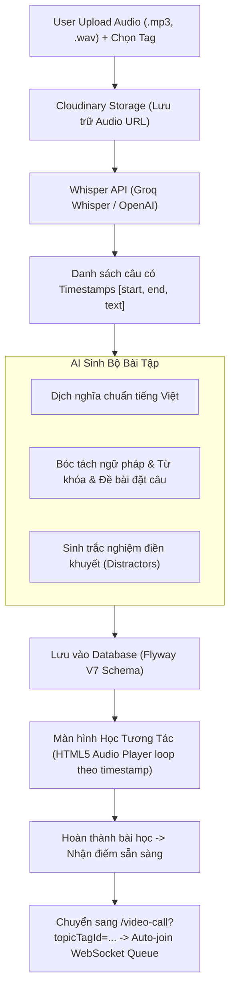

# Đặc Tả Kỹ Thuật: Hệ Thống Chuyển Đổi Audio Sang Bài Học AI & Tích Hợp P2P Video Call

## 1. Mục Tiêu (Objective)
Hiện thực hóa trọn vẹn luồng học khép kín từ **Nạp kiến thức (Input)** đến **Giao tiếp thực chiến (Output)**:
1. Người dùng có thể **chọn bài học có sẵn** hoặc **tự upload file Audio** cá nhân gắn với một Chủ đề (`Tag`).
2. Tích hợp **Whisper STT** để bóc tách file audio thành từng câu kèm mốc thời gian (`start`, `end`).
3. Sử dụng **AI (LLM)** để tự động sinh toàn bộ bộ bài tập theo từng câu:
   - **Luyện nghe & Phản xạ nghĩa**: Dịch nghĩa tiếng Việt, gõ lại câu (Dictation) hoặc đọc lại câu.
   - **Giải thích ngữ pháp & Đặt câu**: Phân tích cấu trúc trọng tâm, trích xuất từ khóa, sinh bài tập đặt câu mới và AI chấm điểm real-time.
   - **Shadowing & Trắc nghiệm**: Player lặp âm thanh theo mốc thời gian câu, trắc nghiệm lựa chọn từ/cụm từ thích hợp.
4. Sau khi hoàn thành bài học, hệ thống **tự động chuyển tiếp vào hàng chờ Ghép đôi P2P** (`/video-call`) với đúng Chủ đề vừa học mà không cần chọn lại thủ công.

---

## 2. Kiến Trúc Luồng Xử Lý (End-to-End Pipeline)



---

## 3. Thiết Kế Cơ Sở Dữ Liệu (Database Schema - Flyway Migration V7)

Để đảm bảo Hibernate `ddl-auto=validate` hoạt động chính xác mà không phá vỡ cấu trúc hiện tại, tạo migration `V7__audio_lessons_and_exercises.sql`:

```sql
-- 1. Bảng lưu trữ bài học Audio
CREATE TABLE IF NOT EXISTS `audio_lessons` (
    `id` BIGINT NOT NULL AUTO_INCREMENT,
    `tag_id` BIGINT NOT NULL,
    `user_id` BIGINT NULL,
    `title` VARCHAR(255) NOT NULL,
    `audio_url` VARCHAR(500) NOT NULL,
    `duration_in_seconds` INT NULL,
    `language` VARCHAR(20) NOT NULL DEFAULT 'ja',
    `status` VARCHAR(20) NOT NULL DEFAULT 'READY', -- PROCESSING, READY, FAILED
    `created_at` DATETIME NOT NULL DEFAULT CURRENT_TIMESTAMP,
    PRIMARY KEY (`id`),
    FOREIGN KEY (`tag_id`) REFERENCES `tags`(`id`),
    FOREIGN KEY (`user_id`) REFERENCES `users`(`id`)
);

-- 2. Bảng lưu các câu nhỏ từ Whisper
CREATE TABLE IF NOT EXISTS `lesson_sentences` (
    `id` BIGINT NOT NULL AUTO_INCREMENT,
    `lesson_id` BIGINT NOT NULL,
    `sentence_index` INT NOT NULL,
    `start_time` DOUBLE NOT NULL,
    `end_time` DOUBLE NOT NULL,
    `original_text` TEXT NOT NULL,
    `phonetic` TEXT NULL,
    `vietnamese_meaning` TEXT NOT NULL,
    PRIMARY KEY (`id`),
    FOREIGN KEY (`lesson_id`) REFERENCES `audio_lessons`(`id`) ON DELETE CASCADE
);

-- 3. Bảng giải thích ngữ pháp và từ khóa của câu
CREATE TABLE IF NOT EXISTS `sentence_grammars` (
    `id` BIGINT NOT NULL AUTO_INCREMENT,
    `sentence_id` BIGINT NOT NULL,
    `grammar_point` VARCHAR(255) NOT NULL,
    `explanation` TEXT NOT NULL,
    `formula` VARCHAR(255) NULL,
    `key_words_json` TEXT NULL, -- Lưu JSON: [{"word": "...", "reading": "...", "meaning": "..."}]
    `sentence_challenge_prompt` TEXT NOT NULL, -- Đề bài yêu cầu đặt câu mới
    PRIMARY KEY (`id`),
    FOREIGN KEY (`sentence_id`) REFERENCES `lesson_sentences`(`id`) ON DELETE CASCADE
);

-- 4. Bảng bài tập trắc nghiệm & shadowing
CREATE TABLE IF NOT EXISTS `sentence_exercises` (
    `id` BIGINT NOT NULL AUTO_INCREMENT,
    `sentence_id` BIGINT NOT NULL,
    `exercise_type` VARCHAR(30) NOT NULL, -- LISTENING_FILL_BLANK, MEANING_MATCH, SHADOWING_CHOICE
    `question` TEXT NOT NULL,
    `options_json` TEXT NOT NULL, -- JSON array các đáp án [A, B, C, D]
    `correct_answer` VARCHAR(255) NOT NULL,
    `explanation` TEXT NULL,
    PRIMARY KEY (`id`),
    FOREIGN KEY (`sentence_id`) REFERENCES `lesson_sentences`(`id`) ON DELETE CASCADE
);
```

---

## 4. Đặc Tả Dịch Vụ Backend (Services & API Contracts)

### 4.1. Dịch vụ Whisper (`WhisperTranscriptionService`)
- Tích hợp **Groq Whisper API** (`whisper-large-v3-turbo` endpoint: `https://api.groq.com/openai/v1/audio/transcriptions` với `response_format=verbose_json`).
- Nhận file audio từ Controller $\rightarrow$ Gửi lên Whisper $\rightarrow$ Trích xuất mảng `segments` (`start`, `end`, `text`).

### 4.2. Dịch vụ AI Sinh Bài Học (`AiLessonGeneratorService`)
- Sử dụng `AiProxyService` (hỗ trợ Gemini / Groq Qwen đã có trong dự án).
- Nhận danh sách các câu transcript $\rightarrow$ Gọi LLM với JSON Schema chuẩn:
  ```json
  {
    "sentences": [
      {
        "sentenceIndex": 0,
        "originalText": "...",
        "phonetic": "...",
        "vietnameseMeaning": "...",
        "grammar": {
          "grammarPoint": "Cấu trúc V-te kara",
          "explanation": "Dùng để diễn tả hành động xảy ra sau khi một hành động khác kết thúc.",
          "formula": "V1-te + kara + V2",
          "keyWords": [
            {"word": "食べてから", "meaning": "sau khi ăn"}
          ],
          "sentenceChallengePrompt": "Hãy đặt một câu diễn tả bạn sẽ đi ngủ sau khi xem phim xong."
        },
        "exercise": {
          "type": "LISTENING_FILL_BLANK",
          "question": "ご飯を___から、出かけます。",
          "options": ["食べて", "食べ", "食べる", "食べた"],
          "correctAnswer": "食べて",
          "explanation": "Sau động từ thể 'te' kết hợp với 'kara'."
        }
      }
    ]
  }
  ```

### 4.3. Dịch vụ Chấm Bài Đặt Câu Ngữ Pháp (`GrammarEvaluationService`)
- Endpoint: `POST /api/audio-lessons/evaluate-sentence`
- Nhận: `sentenceId`, `userSentence`, `grammarFormula`, `targetLanguage`.
- LLM kiểm tra xem câu của người dùng:
  1. Đã đúng ngữ pháp mục tiêu chưa?
  2. Từ vựng đã tự nhiên chưa?
  3. Trả về `isCorrect` (true/false), `score` (0-100), `feedback` tiếng Việt và `suggestedSentence`.

---

## 5. Thiết Kế Giao Diện Người Dùng (UI/UX)

### 5.1. Màn hình Tạo bài học Audio (`/practice/audio-lessons/create`)
- Cho phép kéo thả file Audio (`.mp3`, `.wav`, tối đa 5 phút / 10MB).
- Dropdown chọn Chủ đề (`Tag`) thuộc nhóm `TOPIC`.
- Nhập tiêu đề bài học (hoặc để AI tự gợi ý).
- Hiệu ứng loading dạng Stepper:
  1. Tải lên Cloudinary $\rightarrow$ 2. Whisper bóc tách âm thanh $\rightarrow$ 3. AI sinh bài tập $\rightarrow$ Chuyển sang màn hình học.

### 5.2. Màn hình Học Tương Tác 3 Bước (`/practice/audio-lessons/{id}`)
Với từng câu được bóc tách:
1. **Bước 1: Nghe & Nhập câu / Dịch (Listening & Dictation)**:
   - Player phát đúng đoạn audio `[start, end]` của câu đó.
   - Hiển thị nghĩa tiếng Việt. Người học gõ lại câu (hoặc bấm mic đọc).
2. **Bước 2: Giải thích Ngữ pháp & Thử thách đặt câu**:
   - Khung thẻ hiển thị: Điểm ngữ pháp + Công thức + Từ vựng then chốt.
   - Thử thách: Gõ 1 câu mới $\rightarrow$ Bấm "Kiểm tra với AI" $\rightarrow$ Nhận phản hồi và sửa lỗi tức thì.
3. **Bước 3: Shadowing & Lựa chọn đáp án**:
   - Chế độ phát lặp đoạn audio (A-B loop) với thanh chỉnh tốc độ (0.75x, 1.0x).
   - Câu hỏi trắc nghiệm điền từ / chọn phương án thích hợp.

### 5.3. Màn hình Hoàn thành $\rightarrow$ Kết Nối P2P Tức Thì
- Hiển thị Cúp sẵn sàng + Tổng kết số câu đã đạt.
- Nút bấm chính: **"🚀 Ghép Đôi Với Bạn Học Ngay Về Chủ Đề Này"**.
- Khi bấm: Tự động chuyển hướng sang `/video-call?topicTagId={tagId}&autoJoin=true`. Trang `video_call.html` sẽ tự động đọc tham số URL, chọn sẵn Tag và kích hoạt WebSocket `/app/join` tìm bạn mà không cần người dùng thao tác lại.

---

## 6. Kế Hoạch Triển Khai Bằng Subagents

Để triển khai trọn gói, an toàn và nhanh nhất theo kiến trúc dự án:
- **Subagent 1 (Database & Backend Data Model)**:
  - Tạo file migration `V7__audio_lessons_and_exercises.sql`.
  - Viết các Entity: `AudioLesson`, `LessonSentence`, `SentenceGrammar`, `SentenceExercise`.
  - Viết Repositories tương ứng trong `com.example.videocall_marching_language.repository`.
- **Subagent 2 (Whisper & AI Generation Core)**:
  - Tích hợp `WhisperTranscriptionService` (hỗ trợ Groq Whisper API / multipart upload).
  - Viết `AiLessonGeneratorService` sinh toàn bộ nội dung bài học qua `AiProxyService`.
  - Viết `GrammarEvaluationService` chấm câu người học đặt.
- **Subagent 3 (Audio Upload & REST Controllers)**:
  - Viết service lưu trữ file Audio (Cloudinary audio resource type).
  - Viết `AudioLessonController` và `AudioLessonApiController`.
- **Subagent 4 (Frontend UI & Auto-Match P2P)**:
  - Màn hình Upload & Stepper tạo bài học.
  - Giao diện học tương tác (Audio Player đoạn cắt theo timestamps, Form đặt câu AI feedback, Shadowing loop).
  - Cập nhật `video_call.html` để hỗ trợ tham số `topicTagId` và `autoJoin`.
- **Subagent 5 (Build & Verification)**:
  - Chạy `./gradlew test` và `./gradlew build` để verify toàn bộ mã nguồn không lỗi lầm.
