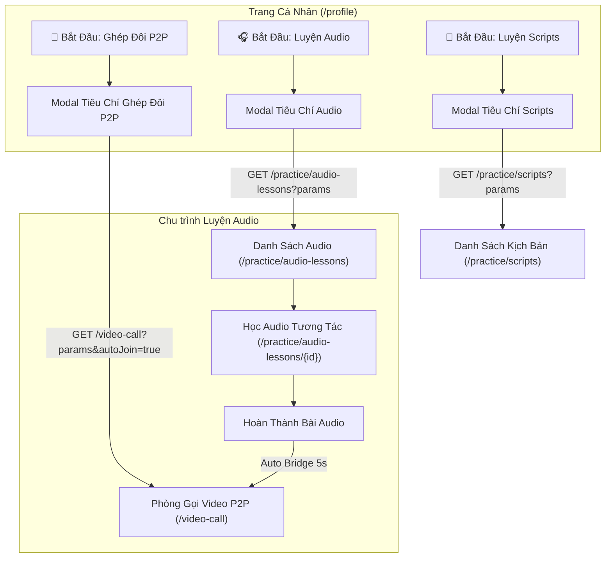
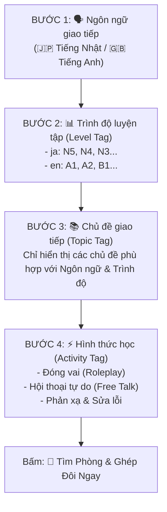

# Đặc Tả Kỹ Thuật: Chuẩn Hóa Hệ Thống Tiêu Chí Đa Chiều Cho Luyện Audio & Ghép Đôi P2P Video Call
## (Multi-dimensional Criteria Standardization for Audio AI Lessons & P2P Video Call Matching)

**Vai trò**: Lead Product & System Architect  
**Trạng thái**: PROPOSED (Trình phê duyệt kiến trúc - Chuẩn bị cho Stage 2/3: Triển khai mã nguồn & Kiểm thử)  
**Tài liệu tham chiếu**: [AGENTS.md](file:///C:/Users/dc130/Desktop/video_marching/AGENTS.md), [spec_cascading_topic_by_language_and_level.md](file:///C:/Users/dc130/Desktop/video_marching/docs/specs/spec_cascading_topic_by_language_and_level.md), [spec_script_criteria_selection_modal.md](file:///C:/Users/dc130/Desktop/video_marching/docs/specs/spec_script_criteria_selection_modal.md), [spec_audio_ai_lesson_and_p2p_pipeline.md](file:///C:/Users/dc130/Desktop/video_marching/docs/specs/spec_audio_ai_lesson_and_p2p_pipeline.md), [spec_audio_to_roleplay_bridge.md](file:///C:/Users/dc130/Desktop/video_marching/docs/specs/spec_audio_to_roleplay_bridge.md)  
**Ngày lập**: 2026-09-12  
**Phiên bản**: 1.0  

---

## 1. Tổng Quan & Bối Cảnh Sản Phẩm (Executive Summary & Product Context)

### 1.1. Hiện trạng & Vấn đề cần giải quyết
Hệ thống **Scripts (Luyện kịch bản AI)** đã được chuẩn hóa thành công với mô hình phân cấp tiêu chí 4 bước:
$$\text{Ngôn ngữ (Language)} \longrightarrow \text{Trình độ (Level)} \longrightarrow \text{Chủ đề (Cascading Topic)} \longrightarrow \text{Hình thức & Giai đoạn (Phase)}$$
Kèm theo:
- Modal chọn tiêu chí thông minh trước khi vào học (tại `users/profile.html` và `users/scripts/list.html`).
- Cơ chế lọc Cascading thời gian thực loại bỏ các chủ đề không có bài học (Zero-count elimination).
- Hệ thống Filter Badges trực quan hiển thị tiêu chí đang active và cho phép xóa/thay đổi nhanh chóng.

Trong khi đó:
1. **Phân hệ Luyện Audio (`/practice/audio-lessons`)**:
   - Trang danh sách hiển thị toàn bộ bài học dạng phẳng, không hỗ trợ lọc theo Ngôn ngữ (`ja`/`en`) hay Trình độ (`N5`..`N1`, `A1`..`C1`).
   - Học viên không biết bài audio nào vừa sức với mình.
   - Bảng `audio_lessons` chưa có trường `level`, dẫn đến thiếu tính đồng bộ với kịch bản Roleplay và hàng chờ P2P.
   - Form tải lên Audio chưa cho phép gắn Trình độ (`level`).
2. **Phân hệ P2P Video Call Ghép Đôi 1-1 (`/video-call`)**:
   - Bảng điều khiển chọn tag (`#setup-panel`) chỉ render 3 dropdown thô (`TOPIC`, `LEVEL`, `ACTIVITY`) từ cơ sở dữ liệu.
   - Hoàn toàn thiếu tiêu chí **Ngôn ngữ giao tiếp** (Tiếng Nhật / Tiếng Anh). Nếu người học tiếng Nhật chọn một chủ đề, họ có thể bị ghép nhầm hoặc hiển thị lẫn lộn các tag tiếng Anh.
   - Danh sách chủ đề không được lọc cascading theo ngôn ngữ và trình độ của học viên.
   - Tại trang cá nhân (`/profile`), người dùng chưa có nút & modal chọn tiêu chí để nhảy thẳng vào phòng ghép đôi P2P tương tự như nút "🎯 Bắt Đầu: Luyện Scripts".

### 1.2. Mục Tiêu Chuẩn Hóa
Áp dụng **100% chuẩn mực tiêu chí của Scripts** vào hai phân hệ **Luyện Audio** và **Ghép Đôi P2P**, tạo ra một trải nghiệm người dùng (Learner UX Flow) nhất quán xuyên suốt toàn bộ nền tảng:
1. Đồng bộ ma trận 4 tiêu chí cốt lõi: **Ngôn ngữ $\rightarrow$ Trình độ $\rightarrow$ Chủ đề $\rightarrow$ Hình thức/Giai đoạn**.
2. Thiết kế Modal chọn tiêu chí độc lập cho Audio (`#audioCriteriaModal`) và P2P (`#p2pCriteriaModal`).
3. Cung cấp Filter Bar & Badges nhận diện tiêu chí trực quan trên trang danh sách Audio.
4. Tái cấu trúc Setup Panel trên màn hình Ghép đôi P2P với bộ lọc Cascading mượt mà.
5. Đảm bảo cầu nối tự động khép kín: Khi hoàn thành Audio Lesson $\rightarrow$ Chuyển tiếp sang P2P mang theo toàn bộ bộ tiêu chí `(language, level, topic)` mà không cần chọn lại.

---

## 2. Kiến Trúc Luồng Người Dùng Tổng Thể (Cross-Module User Flow)



---

## 3. Đặc Tả Chi Tiết Phân Hệ Luyện Audio (Audio Lessons)

### 3.1. Phân cấp 4 Bước Tiêu Chí Cho Audio
1. **Bước 1: 🗣️ Ngôn ngữ bài nghe (Language)**:
   - `all`: 🌐 Tất cả ngôn ngữ
   - `ja`: 🇯🇵 Tiếng Nhật (Japanese)
   - `en`: 🇬🇧 Tiếng Anh (English)
2. **Bước 2: 📊 Trình độ bài nghe (Level)**:
   - Nếu `ja`: `all`, `n5` (Nhập môn), `n4` (Sơ cấp), `n3` (Trung cấp), `n2` (Trung cao), `n1` (Cao cấp).
   - Nếu `en`: `all`, `a1` (Cơ bản), `a2` (Sơ cấp), `b1` (Trung cấp), `b2` (Tự tin), `c1` (Nâng cao).
   - Nếu `all`: `all` + toàn bộ các cấp độ trên.
3. **Bước 3: 📚 Chủ đề bài nghe (Cascading Topic Tag)**:
   - Dropdown lấy từ `TagCategoryType.TOPIC`, phụ thuộc trực tiếp vào `(Language, Level)`.
   - Hiển thị nhãn kèm số lượng: `"[Tên chủ đề] ([N] bài nghe)"`.
   - Tùy chọn mặc định: `"Tất cả chủ đề (Tổng [Total] bài nghe)"`.
   - **Zero-count elimination**: Ẩn các chủ đề có 0 bài nghe trong tổ hợp đã chọn.
4. **Bước 4: ⚡ Trọng tâm luyện tập (Practice Focus)**:
   - `focus=all`: Toàn diện 3 bước (Nghe chép chính tả + Ngữ pháp + Shadowing)
   - `focus=dictation`: Chuyên sâu Luyện nghe & Gõ lại câu (Dictation)
   - `focus=grammar`: Chuyên sâu Phân tích cấu trúc & Đặt câu AI
   - `focus=shadowing`: Chuyên sâu Lặp đoạn phát âm (Shadowing loop) & Trắc nghiệm

### 3.2. Cập nhật Tầng Dữ Liệu (Flyway V11 Migration)
Tạo migration `src/main/resources/db/migration/V11__add_level_to_audio_lessons.sql`:

```sql
-- V11: Bổ sung thuộc tính trình độ (level) vào bảng audio_lessons
SET @col_exists = (
    SELECT COUNT(*) 
    FROM INFORMATION_SCHEMA.COLUMNS 
    WHERE TABLE_SCHEMA = DATABASE() 
      AND TABLE_NAME = 'audio_lessons' 
      AND COLUMN_NAME = 'level'
);

SET @sql = IF(@col_exists = 0,
    'ALTER TABLE `audio_lessons` ADD COLUMN `level` VARCHAR(20) NOT NULL DEFAULT ''N5'' AFTER `language`',
    'SELECT 1'
);
PREPARE stmt FROM @sql; EXECUTE stmt; DEALLOCATE PREPARE stmt;

-- Gán trình độ theo script liên kết nếu đã có
UPDATE `audio_lessons` al
JOIN `scripts` s ON al.script_id = s.id
SET al.level = s.level
WHERE al.script_id IS NOT NULL;

-- Đánh chỉ mục kép tăng tốc truy vấn lọc
SET @idx_exists = (
    SELECT COUNT(*) 
    FROM INFORMATION_SCHEMA.STATISTICS 
    WHERE TABLE_SCHEMA = DATABASE() 
      AND TABLE_NAME = 'audio_lessons' 
      AND INDEX_NAME = 'idx_audio_lessons_language_level'
);

SET @sql_idx = IF(@idx_exists = 0,
    'ALTER TABLE `audio_lessons` ADD INDEX `idx_audio_lessons_language_level` (`language`, `level`)',
    'SELECT 1'
);
PREPARE stmt_idx FROM @sql_idx; EXECUTE stmt_idx; DEALLOCATE PREPARE stmt_idx;
```

### 3.3. DTO & Repository Cho Audio Lessons
1. **`AudioLessonRequest.java`**:
```java
package com.example.videocall_marching_language.dto.audiolesson;

import lombok.*;

@Getter
@Setter
@NoArgsConstructor
@AllArgsConstructor
@Builder
public class AudioLessonRequest {
    private Long tagId;
    private String language;
    private String level;
    private String focus; // all, dictation, grammar, shadowing

    public boolean hasFilterCriteria() {
        return tagId != null
                || (language != null && !language.isBlank() && !"all".equalsIgnoreCase(language))
                || (level != null && !level.isBlank() && !"all".equalsIgnoreCase(level))
                || (focus != null && !focus.isBlank() && !"all".equalsIgnoreCase(focus));
    }
}
```

2. **Cập nhật `IAudioLessonRepository.java`**:
```java
public interface IAudioLessonRepository extends JpaRepository<AudioLesson, Long> {

    @Query("SELECT new com.example.videocall_marching_language.dto.script.TopicWithCountDTO(" +
           "al.tag.id, al.tag.name, LOWER(al.language), LOWER(al.level), COUNT(al.id)) " +
           "FROM AudioLesson al " +
           "WHERE al.tag IS NOT NULL " +
           "GROUP BY al.tag.id, al.tag.name, LOWER(al.language), LOWER(al.level) " +
           "ORDER BY al.tag.name ASC")
    List<TopicWithCountDTO> findTopicsWithAudioLessonCount();

    @Query("SELECT DISTINCT al FROM AudioLesson al LEFT JOIN FETCH al.tag t " +
           "WHERE (:tagId IS NULL OR t.id = :tagId) " +
           "AND (:language IS NULL OR :language = '' OR LOWER(al.language) = LOWER(:language)) " +
           "AND (:level IS NULL OR :level = '' OR :level = 'all' OR LOWER(al.level) = LOWER(:level)) " +
           "ORDER BY al.createdAt DESC")
    List<AudioLesson> findByCriteria(
            @Param("tagId") Long tagId,
            @Param("language") String language,
            @Param("level") String level
    );
}
```

### 3.4. Giao Diện Người Dùng (`users/audio_lessons/list.html`)
- **Filter Bar**: Bổ sung thanh Filter Pills phía trên grid bài học, hiển thị:
  - 🌐 Ngôn ngữ (`🇯🇵 JA`, `🇬🇧 EN`) kèm nút xóa `×`.
  - 📊 Trình độ (`📊 N5`, `📊 A1`) kèm nút xóa `×`.
  - 📚 Chủ đề (`📚 [Tên chủ đề]`) kèm nút xóa `×`.
  - Nút "⚙️ Thay đổi tiêu chí lọc" và "Xóa bộ lọc".
- **Audio Card**:
  - Badge Trình độ: `<span class="meta-badge" style="background: #fef3c7; color: #b45309;">📊 N5</span>`.
  - Badge Ngôn ngữ: `🇯🇵 JA` hoặc `🇬🇧 EN`.
  - Badge Chủ đề & Thời lượng.
- **Modal Tiêu Chí (`#audioCriteriaModal`)**:
  - Dropdown Ngôn ngữ $\rightarrow$ Trình độ $\rightarrow$ Dropdown Chủ đề có đếm bài nghe & zero-count elimination $\rightarrow$ Trọng tâm bài học.
  - Tự động mở khi vào trang mà chưa có tiêu chí hoặc kết quả rỗng.

---

## 4. Đặc Tả Chi Tiết Phân Hệ Ghép Đôi P2P (Video Call Matchmaking)

### 4.1. Phân cấp 4 Bước Tiêu Chí Ghép Đôi P2P
Màn hình cấu hình ghép đôi (`#setup-panel` trong `video_call.html`) và Modal ghép đôi P2P (`#p2pCriteriaModal` trong `profile.html`) được tái cấu trúc theo mô hình 4 bước:



#### Chi tiết các bước:
1. **Bước 1: 🗣️ Ngôn ngữ giao tiếp (Language)**:
   - Lựa chọn: `ja` (Tiếng Nhật) hoặc `en` (Tiếng Anh).
   - Tác động: Tự động lọc danh sách tag Level và Topic phù hợp với ngôn ngữ đó.
2. **Bước 2: 📊 Trình độ luyện tập (Level Tag)**:
   - Nguồn dữ liệu: Các Tag thuộc nhóm `TagCategoryType.LEVEL`.
   - Quy tắc lọc thông minh:
     - Khi chọn Tiếng Nhật: Hiển thị các tag `N5`, `N4`, `N3`... Ưu tiên chọn sẵn theo `currentUserLevel` của người dùng.
     - Khi chọn Tiếng Anh: Hiển thị các tag CEFR (`A1`, `A2`, `B1`...).
3. **Bước 3: 📚 Chủ đề giao tiếp (Topic Tag)**:
   - Nguồn dữ liệu: Các Tag thuộc nhóm `TagCategoryType.TOPIC`.
   - Dropdown thông minh: Khi chọn Tiếng Nhật, các chủ đề Nhật ngữ hiển thị (Giới thiệu bản thân, Mua sắm Combini, Quán ăn...); khi chọn Tiếng Anh, chủ đề tiếng Anh được ưu tiên.
4. **Bước 4: ⚡ Hình thức học (Activity Tag)**:
   - Nguồn dữ liệu: Các Tag thuộc nhóm `TagCategoryType.ACTIVITY`.
   - Các lựa chọn trực quan: Đóng vai (Roleplay), Từ vựng / Đặt câu, Hội thoại tự do.

### 4.2. Modal Ghép Đôi P2P Nhanh Từ Profile (`#p2pCriteriaModal`)
Tại `users/profile.html`, thêm nút Hero thứ 3:
- Nút: `👥 Bắt Đầu: Ghép Đôi P2P` (Màu xanh lá / Success).
- Nhấp vào: Mở Modal `#p2pCriteriaModal`.
- Học viên chọn nhanh 4 bước $\rightarrow$ Bấm "Vào Hàng Chờ Ghép Đôi" $\rightarrow$ Điều hướng sang:
  `/video-call?language=ja&levelTagId=...&topicTagId=...&activityTagId=...&autoJoin=true`

### 4.3. Nâng cấp Giao diện Setup Panel trên `video_call.html`
Thay thế 3 selectbox thô bằng Form Card 4 bước trực quan:
- Thẻ chọn Ngôn ngữ (Radio/Card Button có cờ 🇯🇵 / 🇬🇧).
- Selectbox Trình độ (tự động cập nhật theo ngôn ngữ).
- Selectbox Chủ đề bài học.
- Selectbox Hình thức tương tác.
- Tích hợp JS tự động chọn giá trị truyền vào từ URL query params (`language`, `topicTagId`, `levelTagId`, `activityTagId`, `autoJoin`).

---

## 5. Cầu Nối Khép Kín: Hoàn Thành Audio $\rightarrow$ Ghép Đôi P2P Chuẩn Xác

Khi học viên hoàn thành bài học Audio tại `/practice/audio-lessons/{id}`:
- Hệ thống đã biết:
  - `language`: Ngôn ngữ của bài học (`lesson.language`).
  - `level`: Trình độ của bài học (`lesson.level`).
  - `topicTagId`: Chủ đề của bài học (`lesson.tagId`).
- Tại Modal chúc mừng hoàn thành:
  - Nút Hero 1: Chuyển sang AI Roleplay Script (`/practice/audio-lessons/{id}/roleplay`).
  - Nút Hero 2: **"🚀 Ghép Đôi Với Bạn Học Ngay Về Chủ Đề Này"**.
  - Đường dẫn được nâng cấp:
    `/video-call?language=${lesson.language}&level=${lesson.level}&topicTagId=${lesson.tagId}&autoJoin=true`
- Trang `video_call.js` đọc các tham số này, tự động chọn đúng ngôn ngữ, level tag tương ứng, topic tag và kích hoạt tìm kiếm mà người học không phải click lại bất kỳ tùy chọn nào!

---

## 6. Kế Hoạch Triển Khai Cho Stage 2/3 (Implementation Roadmap)

### Bước 1: Cơ sở dữ liệu & Data Layer
- [ ] Tạo file migration `V11__add_level_to_audio_lessons.sql`.
- [ ] Cập nhật entity `AudioLesson.java`: thêm trường `level` (`VARCHAR(20)`, mặc định `"N5"`).
- [ ] Cập nhật `AudioLessonDTO.java`: thêm `level`.
- [ ] Cập nhật `IAudioLessonRepository.java`: thêm `findTopicsWithAudioLessonCount()` và `findByCriteria(...)`.

### Bước 2: Tầng Nghiệp Vụ & Dịch Vụ (Service Layer)
- [ ] Cập nhật `AudioLessonService.java`:
  - Thêm phương thức `findLessonsByCriteria(AudioLessonRequest request)`.
  - Thêm phương thức `getTopicsWithAudioLessonCount()`.
  - Cập nhật phương thức tạo audio lesson nhận thêm tham số `level`.
- [ ] Cập nhật `MatchMakingService.java` / DTO nếu cần bổ sung nhận diện ngôn ngữ.

### Bước 3: Tầng Controller & API
- [ ] Cập nhật `AudioLessonController.java`:
  - `listAudioLessons`: Tiếp nhận `AudioLessonRequest`, inject danh sách bài học đã lọc, ma trận số lượng chủ đề `topicsWithCountJson`, danh sách ngôn ngữ, cờ `shouldOpenModal`.
- [ ] Cập nhật `WebController.java`:
  - Truyền dữ liệu ngôn ngữ và mapping tag theo ngôn ngữ xuống `video_call.html`.
- [ ] Cập nhật `ProfileController.java`:
  - Bổ sung dữ liệu cho `#audioCriteriaModal` và `#p2pCriteriaModal`.

### Bước 4: Tầng Giao Diện Người Dùng (Views & JS)
- [ ] Cập nhật `users/audio_lessons/list.html`:
  - Thêm Modal `#audioCriteriaModal` chuẩn Bootstrap 5 với cascading 3 cấp (Ngôn ngữ $\rightarrow$ Trình độ $\rightarrow$ Chủ đề có đếm bài học).
  - Thêm thanh Active Filter Bar (Pills cho Language, Level, Topic).
  - Cập nhật Audio Lesson Card hiển thị Badge Level & Language.
  - Cập nhật Upload Modal cho phép chọn Level và Language.
- [ ] Cập nhật `users/video_call.html` & `video_call.js`:
  - Nâng cấp `#setup-panel` thành 4 bước (Ngôn ngữ $\rightarrow$ Trình độ $\rightarrow$ Chủ đề $\rightarrow$ Hình thức).
  - Cập nhật JS đọc URL parameters (`language`, `level`, `topicTagId`, `autoJoin`) và kích hoạt tìm phòng tự động.
- [ ] Cập nhật `users/profile.html`:
  - Thêm Modal chọn tiêu chí Luyện Audio (`#audioCriteriaModal`).
  - Thêm Modal chọn tiêu chí Ghép đôi P2P (`#p2pCriteriaModal`).
  - Thêm nút kích hoạt tương ứng trên giao diện Profile.

### Bước 5: Kiểm Thử Tự Động & Hồi Quy (Verification)
- [ ] Chạy `./gradlew test` kiểm tra toàn bộ unit & integration tests hiện hữu.
- [ ] Viết test mới kiểm tra `AudioLessonService.findLessonsByCriteria` và cascading count.
- [ ] Chạy `./gradlew build` đảm bảo build thành công 100%.

---

## 7. Phân Tích Rủi Ro & Đảm Bảo Tương Thích Ngược (Risk & Compatibility)

| Rủi ro tiềm ẩn | Mức độ | Biện pháp giảm thiểu |
| :--- | :--- | :--- |
| **Hibernate ddl-auto=validate lỗi** | Cao | File Flyway V11 đồng bộ chính xác kiểu cột (`VARCHAR(20) NOT NULL DEFAULT 'N5'`) với Entity `AudioLesson`. |
| **Dữ liệu bài học cũ thiếu level** | Trung bình | Câu lệnh `UPDATE` trong V11 tự động gán level từ `scripts` liên kết hoặc fallback về `'N5'`. |
| **Luồng Video Call cũ bị gián đoạn** | Thấp | Tham số URL mới (`language`, `level`) là tùy chọn; nếu không có, hệ thống vẫn fallback về lựa chọn tag mặc định. |
| **Giao diện Modal xung đột JS** | Thấp | Tách riêng ID modal (`criteriaModal` cho Scripts, `audioCriteriaModal` cho Audio, `p2pCriteriaModal` cho P2P). |
