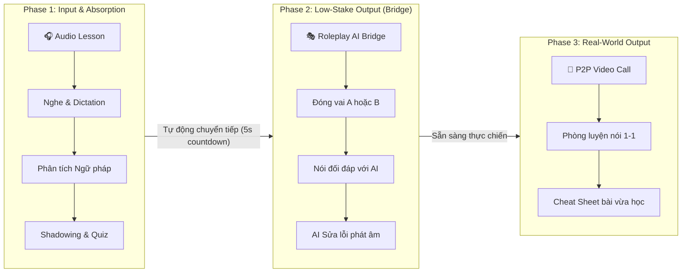
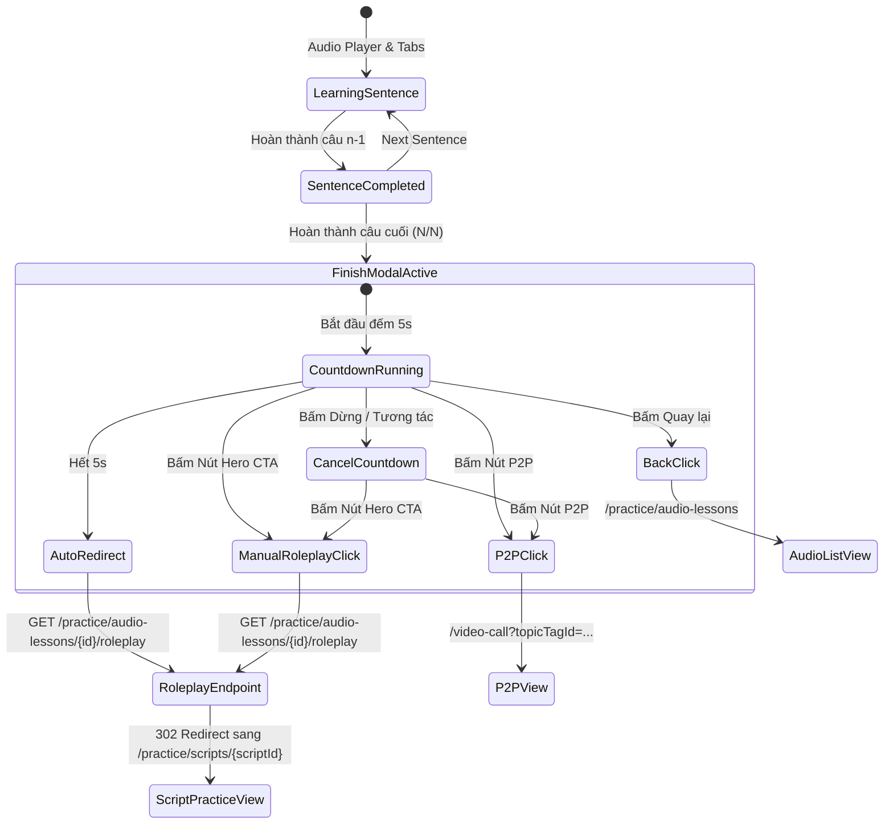
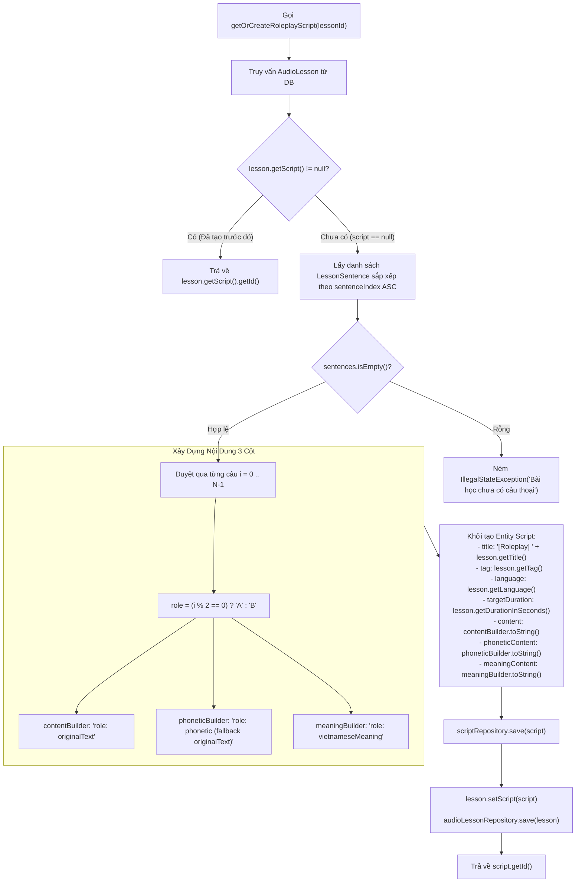
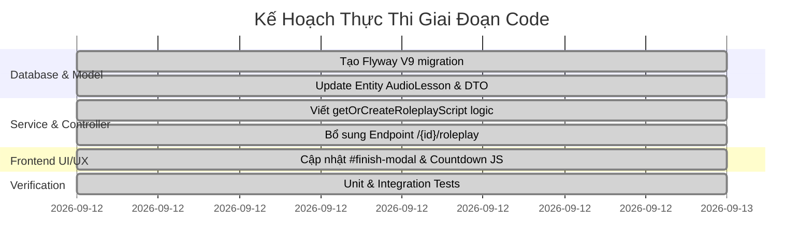

# Kiến Trúc Hệ Thống: Cầu Nối Bài Học Audio Sang Kịch Bản Roleplay Đóng Vai Với AI (Audio-to-Roleplay Bridge)

**Vai trò**: Lead Product & System Architect  
**Trạng thái**: APPROVED (Phê duyệt cho Stage Code)  
**Tài liệu tham chiếu**: [AGENTS.md](file:///C:/Users/dc130/Desktop/video_marching/AGENTS.md), [spec_audio_ai_lesson_and_p2p_pipeline.md](file:///C:/Users/dc130/Desktop/video_marching/docs/specs/spec_audio_ai_lesson_and_p2p_pipeline.md), [spec_learner_absorption_ux_flow.md](file:///C:/Users/dc130/Desktop/video_marching/docs/specs/spec_learner_absorption_ux_flow.md)  
**Ngày lập**: 2026-09-12  

---

## 1. Tổng Quan & Mục Tiêu Kiến Trúc (Architecture Overview)

### 1.1. Bối cảnh & Điểm nghẽn hiện tại (Current Problem)
Hệ thống hiện tại hoàn thiện 2 mô-đun độc lập:
1. **Audio AI Lessons** (`/practice/audio-lessons/{id}`): Học viên tải lên audio, Whisper bóc tách câu, AI sinh bài tập nghe, giải thích ngữ pháp và trắc nghiệm. Khi hoàn thành, modal kết thúc chỉ có 1 lựa chọn duy nhất là nhảy thẳng sang ghép đôi P2P video call với người lạ (`/video-call`).
2. **AI Roleplay Scripts** (`/practice/scripts/{id}`): Học viên nhập vai thoại xen kẽ (Role A / Role B) cùng AI, được AI phân tích giọng nói và phản hồi theo lượt.

**Điểm nghẽn sư phạm**: Việc chuyển thẳng từ "Nghe thụ động / Gõ bài tập" sang "Giao tiếp P2P với người thật" tạo rào cản tâm lý cực lớn (high cognitive load & performance anxiety) đối với học viên ngoại ngữ. Học viên vừa học xong một đoạn hội thoại nhưng chưa được mở khẩu hình để luyện nói theo ngữ cảnh trước khi bước vào phòng gọi trực tiếp.

### 1.2. Giải pháp kiến trúc: Chu trình Hấp thụ Ngôn ngữ Khép kín (The 3-Phase Absorption Pipeline)
Hệ thống thiết lập chuỗi giá trị 3 bước liền mạch (Flywheel Pipeline):


---

## 2. Luồng Trải Nghiệm Người Dùng (UX Journey & Finite State Machine)

### 2.1. Hành vi Modal Hoàn thành (`#finish-modal`) tại `/practice/audio-lessons/{id}`
Khi học viên hoàn thành câu cuối cùng của bài học Audio:
1. Modal `#finish-modal` hiển thị với giao diện chúc mừng.
2. **Nút Ưu tiên số 1 (Hero CTA)**:
   - Nhãn: `🎭 Luyện Kịch Bản Roleplay Đóng Vai (Cùng AI)`
   - Đường dẫn: `/practice/audio-lessons/{id}/roleplay`
   - Hiệu ứng: Nút nổi bật nhất với màu gradient (`from-indigo-600 to-purple-600`), hiệu ứng pulse nhẹ.
3. **Cơ chế đếm ngược tự động (Auto-redirect Timer)**:
   - Hiển thị badge / thanh đếm ngược: `Tự động chuyển tiếp sang Roleplay sau 5s...`
   - Kèm nút `Tạm dừng` hoặc `Hủy đếm ngược` để học viên muốn ở lại xem lại tổng kết.
   - Khi hết 5 giây (và không bị tạm dừng), trình duyệt tự động chuyển hướng sang `/practice/audio-lessons/{id}/roleplay`.
4. **Lựa chọn thay thế (Secondary Actions)**:
   - Nút thứ cấp: `🚀 Bỏ qua Roleplay, Ghép Đôi P2P Ngay` (`/video-call?topicTagId={tagId}&autoJoin=true`).
   - Nút text link: `Quay lại danh sách bài học` (`/practice/audio-lessons`).



---

## 3. Thiết Kế Cơ Sở Dữ Liệu & Liên Kết (Data Model & Bridge)

### 3.1. Flyway Migration Schema (`V9__link_audio_lessons_to_scripts.sql`)
Để kết nối `audio_lessons` với `scripts` một cách an toàn, tuân thủ nghiêm ngặt chuẩn `spring.jpa.hibernate.ddl-auto=validate`:

```sql
-- Migration: V9__link_audio_lessons_to_scripts.sql
-- Mô tả: Bổ sung liên kết khóa ngoại giữa audio_lessons và scripts

ALTER TABLE `audio_lessons`
ADD COLUMN `script_id` BIGINT NULL AFTER `user_id`,
ADD CONSTRAINT `fk_audio_lessons_script`
    FOREIGN KEY (`script_id`) REFERENCES `scripts`(`id`)
    ON DELETE SET NULL;
```
> [!NOTE]
> `ON DELETE SET NULL` đảm bảo tính toàn vẹn dữ liệu: nếu một kịch bản script bị xóa trong tương lai, bài học audio gốc không bị mất mà chỉ chuyển `script_id` về null để có thể tái sinh khi cần.

### 3.2. Cập Nhật Entity `AudioLesson.java`
Bổ sung quan hệ `@OneToOne` (hoặc `@ManyToOne`) lazy loading vào Entity `AudioLesson`:

```java
package com.example.videocall_marching_language.entity;

// ... imports

@Entity
@Table(name = "audio_lessons")
@Getter
@Setter
@NoArgsConstructor
@AllArgsConstructor
@Builder
public class AudioLesson {

    // ... các trường hiện có (id, tag, user, title, audioUrl, durationInSeconds, language, status, createdAt, sentences)

    @OneToOne(fetch = FetchType.LAZY)
    @JoinColumn(name = "script_id")
    private Script script;
}
```

### 3.3. Cập Nhật `AudioLessonDTO.java`
Thêm trường `scriptId` vào DTO để phục vụ hiển thị và kiểm tra trạng thái ở tầng Controller/UI:
```java
private Long scriptId;
```

---

## 4. Thuật Toán Tự Động Sinh Kịch Bản Roleplay (Script Generator Algorithm)

### 4.1. Nguyên Lý Chuyển Đổi Hội Thoại Xen Kẽ (A/B Dialogue Turn Generation)
Trang luyện kịch bản `users/scripts/learn.html` sử dụng bộ bóc tách `SentenceSplitterUtil.parseScriptLines(...)`, dựa trên định dạng tiền tố vai diễn:
- Cấu trúc: `A: [nội dung câu thoại A]\nB: [nội dung câu thoại B]\nA: ...`
- Tương ứng 1-1 với `phoneticContent` và `meaningContent`.

### 4.2. Đặc Tả Thuật Toán Chi Tiết
Quy trình thực hiện trong service method `AudioLessonService.getOrCreateRoleplayScript(Long lessonId)`:



### 4.3. Định Dạng Chuẩn Hóa Chuỗi Kịch Bản
Ví dụ bài học có 3 câu:
1. Câu 0: `originalText`: "初めまして、田中です。", `phonetic`: "はじめまして、たなかです。", `vietnameseMeaning`: "Rất vui được gặp bạn, tôi là Tanaka."
2. Câu 1: `originalText`: "初めまして、マイです。よろしくお願いします。", `phonetic`: "はじめまして、まいです。よろしくおねがいします。", `vietnameseMeaning`: "Chào bạn, tôi là Mai. Rất mong được giúp đỡ."
3. Câu 2: `originalText`: "こちらこそ、よろしくお願いします。", `phonetic`: "こちらこそ、よろしくおねがいします。", `vietnameseMeaning`: "Chính tôi mới là người mong được giúp đỡ."

Kết quả sinh ra trong `Script`:
- `content`:
  ```text
  A: 初めまして、田中です。
  B: 初めまして、マイです。よろしくお願いします。
  A: こちらこそ、よろしくお願いします。
  ```
- `phoneticContent`:
  ```text
  A: はじめまして、たなかです。
  B: はじめまして、まいです。よろしくおねがいします。
  A: こちらこそ、よろしくおねがいいたします。
  ```
- `meaningContent`:
  ```text
  A: Rất vui được gặp bạn, tôi là Tanaka.
  B: Chào bạn, tôi là Mai. Rất mong được giúp đỡ.
  A: Chính tôi mới là người mong được giúp đỡ.
  ```

---

## 5. Thiết Kế Điều Hướng Controller (Routing & Controller Interface)

### 5.1. Controller Endpoint Contract
Cập nhật `AudioLessonController.java`:

```java
@GetMapping("/{id}/roleplay")
public String startRoleplayFromAudioLesson(@PathVariable Long id) {
    Long scriptId = audioLessonService.getOrCreateRoleplayScript(id);
    return "redirect:/practice/scripts/" + scriptId;
}
```

### 5.2. Luồng Xử Lý HTTP
1. Client gửi yêu cầu: `GET /practice/audio-lessons/{id}/roleplay`.
2. Controller gọi `audioLessonService.getOrCreateRoleplayScript(id)`:
   - Nếu bài học đã được liên kết với `script_id`, trả về ngay ID đó mà không tốn chi phí sinh lại (Idempotent).
   - Nếu chưa có, kích hoạt thuật toán sinh kịch bản A/B, lưu vào `scripts`, cập nhật `audio_lessons.script_id` và trả về ID vừa tạo.
3. Controller trả về HTTP 302 Redirect: `Location: /practice/scripts/{scriptId}`.
4. Trình duyệt tải trang `/practice/scripts/{scriptId}` (do `PracticeController.getScriptById` đảm nhiệm).

---

## 6. Tính Tương Thích Với `users/scripts/learn.html` (Front-end Compatibility)

Khi redirect sang `/practice/scripts/{scriptId}`, hệ thống tận dụng 100% sức mạnh hiện hữu của `users/scripts/learn.html` mà không cần sửa đổi lớn ở view kịch bản:
1. **Tab 1: Nạp kiến thức (Vocab Deck & Dialogue Table)**:
   - Bảng thoại hiển thị hai vai A (màu xanh chàm) và B (màu hồng) xen kẽ.
   - Có nút phát âm từng câu, phiên âm Hiragana/Romaji và nghĩa tiếng Việt đi kèm.
2. **Tab 2: Luyện nói cùng AI (Roleplay Chat)**:
   - Học viên được chọn vai: **Đóng vai A** hoặc **Đóng vai B**.
   - Nếu học viên chọn vai A: AI tự động phát âm câu vai B (TTS), học viên bấm mic nói câu vai A.
   - Hệ thống đánh giá giọng nói theo thời gian thực (Fast-path 100% khớp hoặc Gemini AI chấm lỗi phát âm theo từ).
3. **Tab 3: Sẵn sàng thực chiến (Readiness & P2P Call)**:
   - Sau khi hoàn thành toàn bộ lượt thoại, màn hình vinh danh học viên đã sẵn sàng giao tiếp thực tế và cung cấp nút kết nối P2P Video Call.

---

## 7. Đảm Bảo Độ Tin Cậy, Đua Lệnh & Các Trường Hợp Biên (Reliability & Edge Cases)

| STT | Trường hợp biên (Edge Case) | Nguy cơ tiềm ẩn | Giải pháp kiến trúc |
|:---|:---|:---|:---|
| 1 | **Đua lệnh khi tạo kịch bản (Race Condition)** | 2 học viên cùng bấm vào Roleplay một bài học audio dùng chung cùng lúc, có thể dẫn đến việc tạo ra 2 Script trùng lặp. | Bọc `@Transactional` tại Service layer. Kiểm tra `if (lesson.getScript() != null)` trước khi khởi tạo, đồng thời đồng bộ hóa tiến trình nếu cần. |
| 2 | **Phiên âm (Phonetic) bị trống** | Một số câu tiếng Anh hoặc Whisper không trả về phiên âm, dẫn đến cột `phoneticContent` rỗng. | Fallback tự động: nếu `phonetic == null || phonetic.isBlank()`, sử dụng `originalText`. |
| 3 | **Dịch nghĩa tiếng Việt bị trống** | Câu chưa kịp dịch nghĩa khiến `meaningContent` thiếu dòng tương ứng. | Fallback: gán chuỗi rỗng hoặc chính `originalText` để đảm bảo số dòng thoại giữa content - phonetic - meaning luôn khớp 1-1. |
| 4 | **Bài học chỉ có 1 câu duy nhất** | Không đủ 2 người đối thoại A và B. | Thuật toán vẫn gán vai A cho câu 0. Học viên luyện phát âm câu này với AI như bình thường. |
| 5 | **Học viên muốn dừng đếm ngược 5 giây** | Tự động chuyển hướng khi học viên chưa kịp xem xong kết quả của bài audio. | Thêm nút `Dừng đếm ngược` và tự động hủy timer nếu học viên click vào màn hình modal hoặc tương tác với nút khác. |

---

## 8. Kế Hoạch Triển Khai Cho Giai Đoạn Code (Stage Code Checklist)



### Danh Mục File Cần Thao Tác:
1. `src/main/resources/db/migration/V9__link_audio_lessons_to_scripts.sql`: Tạo migration thêm `script_id` vào `audio_lessons`.
2. `src/main/java/com/example/videocall_marching_language/entity/AudioLesson.java`: Thêm trường `private Script script`.
3. `src/main/java/com/example/videocall_marching_language/dto/audiolesson/AudioLessonDTO.java`: Thêm trường `private Long scriptId`.
4. `src/main/java/com/example/videocall_marching_language/service/audiolesson/AudioLessonService.java`:
   - Inject `IScriptRepository`.
   - Viết method `Long getOrCreateRoleplayScript(Long lessonId)`.
   - Cập nhật mapping `getLessonById()` để đưa `scriptId` vào `AudioLessonDTO`.
5. `src/main/java/com/example/videocall_marching_language/controller/user/AudioLessonController.java`: Thêm method `startRoleplayFromAudioLesson(@PathVariable Long id)`.
6. `src/main/resources/templates/users/audio_lessons/learn.html`:
   - Thiết kế lại `#finish-modal` với Hero Button chuyển Roleplay, thanh đếm ngược 5 giây có thể hủy/tạm dừng.
   - Giữ nút phụ kết nối P2P.
7. `src/test/java/...`: Viết kiểm thử tự động cho luồng sinh kịch bản và redirect.

---

## 9. Quyết Định Phê Duyệt Của Kiến Trúc Sư Trưởng (Architect Sign-Off)

> [!IMPORTANT]
> **QUYẾT ĐỊNH PHÊ DUYỆT (ARCHITECTURAL APPROVAL)**:  
> Bản thiết kế kiến trúc tính năng **"Audio-to-Roleplay Bridge"** đáp ứng đầy đủ các tiêu chuẩn kỹ thuật của dự án:
> 1. ✅ **Chuẩn kiến trúc**: Đảm bảo nguyên tắc phân tầng `Entity -> Repository -> Service -> Controller`.
> 2. ✅ **An toàn dữ liệu**: Đảm bảo Hibernate `ddl-auto=validate` với migration Flyway `V9`.
> 3. ✅ **Tối ưu trải nghiệm**: Khép kín chu trình học ngoại ngữ 3 bước (Nghe hiểu -> Đóng vai AI -> Giao tiếp P2P thực chiến).
> 4. ✅ **Khả năng tái sử dụng**: Tận dụng 100% hạ tầng kiểm thử giọng nói AI và phân tích vai thoại của `learn.html`.
> 
> **Ký duyệt chuyển giao sang Stage Code**: `APPROVED`
