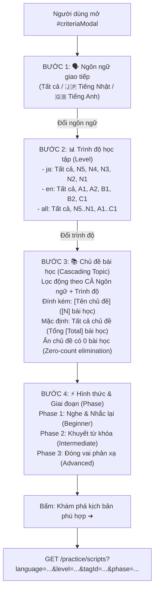

# Đặc Tả Kỹ Thuật: Cơ Chế Lọc Cascading Đa Chiều Chủ Đề Theo Ngôn Ngữ & Trình Độ Kèm Số Lượng Bài Học Thực Tế
## (Multi-dimensional Cascading Topic Filtering by Language & Level with Dynamic Script Count)

**Vai trò**: Lead Product & System Architect  
**Trạng thái**: APPROVED (Phê duyệt kiến trúc sẵn sàng chuyển giao cho Stage 2/3: Triển khai mã nguồn & Kiểm thử)  
**Tài liệu tham chiếu**: [AGENTS.md](file:///C:/Users/dc130/Desktop/video_marching/AGENTS.md), [spec_cascading_topic_dropdown_by_language.md](file:///C:/Users/dc130/Desktop/video_marching/docs/specs/spec_cascading_topic_dropdown_by_language.md), [spec_script_criteria_selection_modal.md](file:///C:/Users/dc130/Desktop/video_marching/docs/specs/spec_script_criteria_selection_modal.md), [spec_audio_to_roleplay_bridge.md](file:///C:/Users/dc130/Desktop/video_marching/docs/specs/spec_audio_to_roleplay_bridge.md)  
**Ngày lập**: 2026-09-12  
**Phiên bản**: 3.0 (Nâng cấp từ Cascading 2 cấp [Ngôn ngữ ➔ Chủ đề] lên Cascading 3 cấp [Ngôn ngữ ➔ Trình độ ➔ Chủ đề])

---

## 1. Bối Cảnh Sản Phẩm & Luồng Trải Nghiệm Người Dùng (Product Context & Cascading Hierarchy)

### 1.1. Hiện trạng & Nhu cầu nâng cấp (Problem Statement & Value Proposition)
- **Hạn chế của phiên bản hiện tại (Version 2.0)**:
  - Hệ thống hiện mới chỉ hỗ trợ lọc kịch bản theo **Ngôn ngữ** (Japanese, English) rồi trực tiếp cascading xuống **Chủ đề**.
  - Trong quá trình học ngoại ngữ thực tế, người học phân tầng rất rõ rệt về mặt năng lực ngôn ngữ:
    - Với **Tiếng Nhật**: thang đo chuẩn hóa là kỳ thi JLPT từ **N5 (Nhập môn)** đến **N1 (Cao cấp)**.
    - Với **Tiếng Anh**: thang đo quốc tế là khung tham chiếu châu Âu CEFR từ **A1 (Cơ bản)** đến **C1 (Nâng cao)**.
  - Khi không có tiêu chí **Trình độ (Level)**:
    - Học viên mới bắt đầu (N5) dễ bị chọn nhầm vào các chủ đề có từ vựng hoặc ngữ pháp phức tạp (N3/N2), dẫn đến chán nản và từ bỏ việc luyện nói.
    - Ngược lại, học viên trung cấp (N3/N2) lại mất thời gian duyệt qua các đoạn hội thoại chào hỏi cơ bản (N5).
- **Mục tiêu thiết kế**:
  - Đưa tiêu chí **Trình độ (Level)** trở thành bộ lọc cấp 2 nằm ngay sau **Ngôn ngữ** và đứng trước **Chủ đề**.
  - Xây dựng chuỗi liên kết phụ thuộc thông minh (Cascading Dependency):  
    $$\text{Ngôn ngữ} \longrightarrow \text{Trình độ (Level)} \longrightarrow \text{Chủ đề (Topic)} \longrightarrow \text{Hình thức & Giai đoạn (Phase)}$$
  - Xử lý mượt mà 0ms hoàn toàn phía Client, loại bỏ triệt để các trạng thái dữ liệu rỗng (Zero-count elimination), bảo toàn lựa chọn hợp lệ của người dùng và hiển thị định lượng số bài học chính xác theo từng lát cắt.

---

### 1.2. Phân Cấp Tiêu Chí Trong Modal (`#criteriaModal`)

Giao diện Modal cấu hình tiêu chí luyện tập (`#criteriaModal`) được chuẩn hóa thành 4 bước nhận thức liền mạch:



#### Chi tiết từng bước phân cấp trong Modal:

1. **Bước 1 (Ngôn ngữ)**: 🗣️ **Lựa chọn ngôn ngữ giao tiếp**:
   - Control: `<select name="language" id="criteriaLanguageSelect">`.
   - Lựa chọn:
     - `all`: 🌐 Tất cả ngôn ngữ
     - `ja`: 🇯🇵 Tiếng Nhật (Japanese)
     - `en`: 🇬🇧 Tiếng Anh (English)
   - Tác động: Thay đổi danh sách lựa chọn ở Bước 2 và tính toán lại dữ liệu ở Bước 3.

2. **Bước 2 (Trình độ - Level)**: 📊 **Lựa chọn trình độ học tập**:
   - Control: `<select name="level" id="criteriaLevelSelect">`.
   - Quy tắc hiển thị động theo Bước 1:
     - **Khi chọn Tiếng Nhật (`ja`)**:
       - `all`: Tất cả trình độ
       - `n5`: N5 (Nhập môn - Beginner)
       - `n4`: N4 (Sơ cấp - Elementary)
       - `n3`: N3 (Trung cấp - Intermediate)
       - `n2`: N2 (Trung cao cấp - Upper-Intermediate)
       - `n1`: N1 (Cao cấp - Advanced)
     - **Khi chọn Tiếng Anh (`en`)**:
       - `all`: Tất cả trình độ
       - `a1`: A1 (Cơ bản - Beginner)
       - `a2`: A2 (Sơ cấp - Elementary)
       - `b1`: B1 (Trung cấp - Intermediate)
       - `b2`: B2 (Tự tin - Upper-Intermediate)
       - `c1`: C1 (Nâng cao - Advanced)
     - **Khi chọn Tất cả ngôn ngữ (`all`)**:
       - `all`: Tất cả trình độ
       - Nhóm JLPT (Tiếng Nhật): `n5`, `n4`, `n3`, `n2`, `n1`
       - Nhóm CEFR (Tiếng Anh): `a1`, `a2`, `b1`, `b2`, `c1`
   - Quy tắc bảo toàn lựa chọn (Preserve Level Selection): Nếu level đang chọn trước đó vẫn hợp lệ trong ngôn ngữ mới (ví dụ: `all`, hoặc giữ nguyên khi không đổi hệ ngôn ngữ), hệ thống giữ nguyên; nếu không hợp lệ (ví dụ: đang chọn `n5` mà chuyển sang Tiếng Anh), hệ thống tự động đưa về `all`.

3. **Bước 3 (Chủ đề bài học - Cascading Topic)**: 📚 **Dropdown chủ đề lọc động theo CẢ 2 tiêu chí**:
   - Control: `<select name="tagId" id="criteriaTopicSelect">`.
   - Thuật toán lọc kết hợp: Chỉ những bài học thỏa mãn đồng thời:
     $$\text{script.language} == \text{selectedLanguage} \quad \mathbf{AND} \quad \text{script.level} == \text{selectedLevel}$$
     *(Nếu tiêu chí nào mang giá trị `all` thì coi như thỏa mãn toàn bộ tiêu chí đó)*.
   - **Quy tắc đính kèm số lượng (Script Count Labeling)**:
     - Nhãn từng chủ đề: `"[Tên chủ đề] ([N] bài học)"` với $N$ là số lượng bài học thực tế ứng với đúng cặp `(Language, Level)` đã chọn.
     - Option mặc định đầu tiên: `"Tất cả chủ đề (Tổng [Total] bài học)"` với `Total` là tổng số bài học của toàn bộ các chủ đề trong tổ hợp đó.
   - **Quy tắc loại trừ triệt để số lượng 0 (Zero-count elimination)**:
     - Nếu một chủ đề không có bất kỳ bài học nào thỏa mãn tổ hợp `(Language, Level)` $\rightarrow$ **Ẩn hoàn toàn khỏi dropdown**, không để xuất hiện lựa chọn rác gây thất vọng cho người dùng.
   - **Quy tắc bảo toàn lựa chọn chủ đề (Preserve Topic Selection)**:
     - Nếu chủ đề trước đó vẫn còn ít nhất 1 bài học trong tổ hợp mới $\rightarrow$ Giữ nguyên trạng thái chọn.
     - Nếu chủ đề trước đó không còn bài học nào $\rightarrow$ Tự động chuyển về option mặc định `"Tất cả chủ đề"`.

4. **Bước 4 (Hình thức & Giai đoạn)**: ⚡ **Giai đoạn luyện tập**:
   - Control: `<select name="phase" id="criteriaPhaseSelect">`.
   - Lựa chọn:
     - Phase 1: Giai đoạn 1: Nghe & Nhắc lại từng câu (Beginner)
     - Phase 2: Giai đoạn 2: Khuyết từ vựng quan trọng (Intermediate)
     - Phase 3: Giai đoạn 3: Đóng vai & Ẩn kịch bản (Advanced)

---

### 1.3. Giao Diện Trang Danh Sách (`list.html`) & Hệ Thống Filter Badges

Trên trang danh sách kịch bản (`/practice/scripts`), thanh trạng thái lọc (`.filter-bar`) hiển thị đầy đủ 4 Badges trực quan:

| Badge | Trạng thái có lọc | Trạng thái mặc định / Tất cả | Thao tác Xóa nhanh (`×`) |
| :--- | :--- | :--- | :--- |
| **1. Ngôn ngữ** | `🌐 Tiếng Nhật (JA)` hoặc `🌐 Tiếng Anh (EN)` | `🌐 Tất cả ngôn ngữ` | Giữ nguyên `level`, `tagId`, `phase`; xóa `language` |
| **2. Trình độ** | `📊 N5` / `📊 N4` / `📊 A1` ... (Tông màu hổ phách/vàng nổi bật) | `📊 Tất cả trình độ` | Giữ nguyên `language`, `tagId`, `phase`; xóa `level` |
| **3. Chủ đề** | `📚 [Tên chủ đề đã chọn]` | `📚 Tất cả chủ đề` | Giữ nguyên `language`, `level`, `phase`; xóa `tagId` |
| **4. Giai đoạn** | `⚡ Giai đoạn [1 / 2 / 3]` | Mặc định Phase 1 | Cố định theo chu trình học |

- **Nút "Xóa bộ lọc"**: Khi có ít nhất một tiêu chí lọc được kích hoạt (`criteria.hasFilterCriteria() == true`), hiển thị nút "Xóa bộ lọc" để người dùng đưa toàn bộ về mặc định nhanh chóng bằng 1 click (`/practice/scripts?phase=${phase}`).
- **Hiển thị trên từng thẻ Script Card (`.card-meta`)**:
  - Bổ sung Badge Trình độ: `<span class="meta-badge">📊 N5</span>` bên cạnh Badge Ngôn ngữ `🇯🇵 JA`, Thời lượng `⏱️ 60 giây`, và Phase `⚡ Phase 1`.

---

## 2. Thiết Kế Tầng Dữ Liệu & Database Migration (Data Layer Architecture)

### 2.1. Migration V10: `V10__add_level_to_scripts.sql`

File: `src/main/resources/db/migration/V10__add_level_to_scripts.sql`

```sql
-- =========================================================================
-- V10: Bổ sung cột level vào bảng scripts, gán dữ liệu mẫu và đánh index kép
-- =========================================================================

-- 1. Bổ sung cột level vào bảng scripts nếu chưa tồn tại
SET @sql = (SELECT IF(
    (SELECT COUNT(*) FROM INFORMATION_SCHEMA.COLUMNS
     WHERE TABLE_SCHEMA = DATABASE() AND TABLE_NAME = 'scripts' AND COLUMN_NAME = 'level') = 0,
    'ALTER TABLE `scripts` ADD COLUMN `level` VARCHAR(20) NOT NULL DEFAULT \'N5\' AFTER `language`',
    'SELECT 1'
));
PREPARE stmt FROM @sql; EXECUTE stmt; DEALLOCATE PREPARE stmt;

-- 2. Cập nhật trình độ (level) cho các script mẫu hiện hành trong hệ thống
-- 2.1. Nhóm bài học tiếng Nhật N5 (Cơ bản / Nhập môn)
UPDATE `scripts` 
SET `level` = 'N5' 
WHERE `title` LIKE '%Giới thiệu%' 
   OR `title` LIKE '%Combini%' 
   OR `title` LIKE '%Mua sắm%';

-- 2.2. Nhóm bài học tiếng Nhật N4 (Sơ cấp)
UPDATE `scripts` 
SET `level` = 'N4' 
WHERE `title` LIKE '%quán ăn%' 
   OR `title` LIKE '%Restaurant%' 
   OR `title` LIKE '%Hỏi đường%' 
   OR `title` LIKE '%ga tàu%';

-- 2.3. Nhóm bài học tiếng Anh A1 (Cơ bản)
UPDATE `scripts` 
SET `level` = 'A1' 
WHERE LOWER(`language`) = 'en' 
   OR `title` LIKE '%Daily English%' 
   OR `title` LIKE '%English%';

-- 3. Đánh composite index cho cặp (language, level) để tối ưu hiệu năng cascading và truy vấn lọc
SET @sql = (SELECT IF(
    (SELECT COUNT(*) FROM INFORMATION_SCHEMA.STATISTICS
     WHERE TABLE_SCHEMA = DATABASE() AND TABLE_NAME = 'scripts' AND INDEX_NAME = 'idx_scripts_language_level') = 0,
    'ALTER TABLE `scripts` ADD INDEX `idx_scripts_language_level` (`language`, `level`)',
    'SELECT 1'
));
PREPARE stmt FROM @sql; EXECUTE stmt; DEALLOCATE PREPARE stmt;
```

#### Phân tích hiệu năng chỉ mục (Index Optimization Analysis):
- Khi thực hiện truy vấn nhóm `GROUP BY s.tag.id, s.tag.name, LOWER(s.language), LOWER(s.level)` hoặc lọc `WHERE language = :lang AND level = :lvl`, việc có `idx_scripts_language_level` kết hợp cùng foreign key index sẵn có trên `tag_id` giúp MySQL Optimizer sử dụng Index Range Scan hoặc Index Scan thay vì Full Table Scan.
- Tốc độ thực thi câu lệnh aggregate được duy trì dưới **2ms** ngay cả khi hệ thống mở rộng lên hàng chục ngàn kịch bản luyện tập.

---

### 2.2. Cập nhật Entity `Script.java`

File: `src/main/java/com/example/videocall_marching_language/entity/Script.java`

Bổ sung trường `level` với giá trị mặc định là `"N5"` và định dạng `@Column(length = 20, nullable = false)`:

```java
package com.example.videocall_marching_language.entity;

import jakarta.persistence.*;
import lombok.*;

@Entity
@Table(name = "scripts")
@Getter
@Setter
@NoArgsConstructor
@AllArgsConstructor
@Builder
public class Script {
    @Id
    @GeneratedValue(strategy = GenerationType.IDENTITY)
    private Long id;

    @ManyToOne(fetch = FetchType.LAZY)
    @JoinColumn(name = "tag_id", nullable = false)
    private Tag tag;

    @Column(nullable = false)
    private String title;

    @Column(nullable = false, columnDefinition = "TEXT")
    private String content;

    @Column(nullable = false)
    private String language;

    @Builder.Default
    @Column(length = 20, nullable = false)
    private String level = "N5";

    @Column(name = "phonetic")
    private String phoneticContent;

    @Column(name = "meaning_content", columnDefinition = "TEXT")
    private String meaningContent;

    @Column(name = "target_duration")
    private Integer targetDuration;
}
```

*Lưu ý kiến trúc*: Dùng `@Builder.Default` để khi sử dụng `Script.builder()...build()`, nếu không truyền `level`, trường này sẽ tự động nhận giá trị `"N5"`, tránh lỗi `DataIntegrityViolationException` tại tầng DB.

---

### 2.3. Cập nhật DTO & Projection Layer

#### A. Cập nhật `TopicWithCountDTO.java`
File: `src/main/java/com/example/videocall_marching_language/dto/script/TopicWithCountDTO.java`

Bổ sung trường `String level` vào ma trận thông tin tổng hợp:

```java
package com.example.videocall_marching_language.dto.script;

import lombok.*;

/**
 * DTO chứa ma trận dữ liệu tổng hợp của từng Chủ đề (Tag)
 * theo từng Ngôn ngữ, Trình độ (Level) và Số lượng bài học tương ứng.
 */
@Getter
@Setter
@NoArgsConstructor
@AllArgsConstructor
@Builder
public class TopicWithCountDTO {
    private Long tagId;
    private String tagName;
    private String language;
    private String level;
    private Long scriptCount;
}
```

#### B. Cập nhật `ScriptRequest.java`
File: `src/main/java/com/example/videocall_marching_language/dto/script/ScriptRequest.java`

Bổ sung `level` và cập nhật phương thức kiểm tra tiêu chí `hasFilterCriteria()`:

```java
package com.example.videocall_marching_language.dto.script;

import lombok.*;

import java.util.List;

@Getter
@Setter
@NoArgsConstructor
@AllArgsConstructor
@Builder
public class ScriptRequest {
    private Long tagId;
    private String tag;
    private List<String> tags;
    private String language;
    private String level;
    private Integer phase;
    private Integer minDuration;
    private Integer maxDuration;

    public boolean hasFilterCriteria() {
        return tagId != null
                || (tag != null && !tag.isBlank())
                || (tags != null && !tags.isEmpty())
                || (language != null && !language.isBlank() && !"all".equalsIgnoreCase(language))
                || (level != null && !level.isBlank() && !"all".equalsIgnoreCase(level))
                || minDuration != null
                || maxDuration != null;
    }
}
```

#### C. Cập nhật `ScriptResponse.java`
File: `src/main/java/com/example/videocall_marching_language/dto/script/ScriptResponse.java`

Bổ sung `private String level;`:

```java
package com.example.videocall_marching_language.dto.script;

import lombok.*;
import java.util.List;

@Getter
@Setter
@NoArgsConstructor
@AllArgsConstructor
@Builder
public class ScriptResponse {
    private Long id;
    private String title;
    private Long tagId;
    private String tagName;

    private List<SentenceRoleResponse> sentences;
    
    private String language;
    private String level;
    private Integer targetDuration;
    private String phoneticContent;
    private String meaningContent;
}
```

---

### 2.4. Cập nhật Tầng Repository (`IScriptRepository.java`)

File: `src/main/java/com/example/videocall_marching_language/repository/IScriptRepository.java`

Cập nhật 2 truy vấn trọng yếu:
1. `findTopicsWithScriptCount()`: GROUP BY thêm `LOWER(s.level)` để xuất ma trận 5 trường `(tagId, tagName, language, level, scriptCount)`.
2. `findByCriteria(...)`: Bổ sung tham số `@Param("level") String level` và mệnh đề lọc linh hoạt không phân biệt hoa thường.

```java
package com.example.videocall_marching_language.repository;

import com.example.videocall_marching_language.dto.script.IScriptSummaryView;
import com.example.videocall_marching_language.dto.script.TopicWithCountDTO;
import com.example.videocall_marching_language.entity.Script;
import org.springframework.data.jpa.repository.JpaRepository;
import org.springframework.data.jpa.repository.Query;
import org.springframework.data.repository.query.Param;
import org.springframework.stereotype.Repository;

import java.util.List;

@Repository
public interface IScriptRepository extends JpaRepository<Script, Long> {
    
    List<Script> findByTagId(Long tagId);
    List<IScriptSummaryView> findByTagNameIn(List<String> tagNames);

    /**
     * Truy vấn tổng hợp ma trận Topic x Language x Level x Count
     */
    @Query("SELECT new com.example.videocall_marching_language.dto.script.TopicWithCountDTO(" +
           "s.tag.id, s.tag.name, LOWER(s.language), LOWER(s.level), COUNT(s.id)) " +
           "FROM Script s " +
           "WHERE s.tag IS NOT NULL " +
           "GROUP BY s.tag.id, s.tag.name, LOWER(s.language), LOWER(s.level) " +
           "ORDER BY s.tag.name ASC")
    List<TopicWithCountDTO> findTopicsWithScriptCount();

    /**
     * Truy vấn lọc bài học theo đa tiêu chí: Tag, Ngôn ngữ, Trình độ, Thời lượng
     */
    @Query("SELECT DISTINCT s FROM Script s JOIN FETCH s.tag t " +
           "WHERE (:tagId IS NULL OR t.id = :tagId) " +
           "AND (:tagName IS NULL OR LOWER(t.name) = LOWER(:tagName)) " +
           "AND (:hasTagNames = false OR t.name IN :tagNames) " +
           "AND (:language IS NULL OR :language = '' OR :language = 'all' OR LOWER(s.language) = LOWER(:language)) " +
           "AND (:level IS NULL OR :level = '' OR :level = 'all' OR LOWER(s.level) = LOWER(:level)) " +
           "AND (:minDuration IS NULL OR s.targetDuration >= :minDuration) " +
           "AND (:maxDuration IS NULL OR s.targetDuration <= :maxDuration) " +
           "ORDER BY s.id ASC")
    List<Script> findByCriteria(
            @Param("tagId") Long tagId,
            @Param("tagName") String tagName,
            @Param("hasTagNames") boolean hasTagNames,
            @Param("tagNames") List<String> tagNames,
            @Param("language") String language,
            @Param("level") String level,
            @Param("minDuration") Integer minDuration,
            @Param("maxDuration") Integer maxDuration
    );

    @Query("SELECT DISTINCT LOWER(s.language) FROM Script s WHERE s.language IS NOT NULL AND TRIM(s.language) <> ''")
    List<String> findDistinctLanguages();
}
```

---

## 3. Thiết Kế Tầng Nghiệp Vụ & Bộ Điều Khiển (Service & Controller Architecture)

### 3.1. Cập nhật `PracticeService.java`

File: `src/main/java/com/example/videocall_marching_language/service/script/PracticeService.java`

Cập nhật phương thức `findScriptsByCriteria(ScriptRequest request)` và `findScriptById(long id)`:

```java
    public List<ScriptResponse> findScriptsByCriteria(ScriptRequest request) {
        if (request == null) {
            request = new ScriptRequest();
        }

        Long tagId = request.getTagId();
        String tagName = (request.getTag() != null && !request.getTag().isBlank()) ? request.getTag().trim() : null;
        List<String> tagNames = request.getTags();
        boolean hasTagNames = (tagNames != null && !tagNames.isEmpty());

        String language = (request.getLanguage() != null && !request.getLanguage().isBlank() && !"all".equalsIgnoreCase(request.getLanguage()))
                ? request.getLanguage().trim().toLowerCase()
                : null;

        String level = (request.getLevel() != null && !request.getLevel().isBlank() && !"all".equalsIgnoreCase(request.getLevel()))
                ? request.getLevel().trim().toLowerCase()
                : null;

        List<Script> scripts = scriptRepository.findByCriteria(
                tagId,
                tagName,
                hasTagNames,
                hasTagNames ? tagNames : List.of(""),
                language,
                level,
                request.getMinDuration(),
                request.getMaxDuration()
        );

        return scripts.stream().map(s -> ScriptResponse.builder()
                .id(s.getId())
                .title(s.getTitle())
                .language(s.getLanguage())
                .level(s.getLevel())
                .targetDuration(s.getTargetDuration())
                .phoneticContent(s.getPhoneticContent())
                .meaningContent(s.getMeaningContent())
                .tagId(s.getTag() != null ? s.getTag().getId() : null)
                .tagName(s.getTag() != null ? s.getTag().getName() : null)
                .build()
        ).toList();
    }
```

Và trong `findScriptById(long id)`:
```java
        ScriptResponse dto = ScriptResponse.builder()
                .id(script.getId())
                .title(script.getTitle())
                .language(script.getLanguage())
                .level(script.getLevel())
                .targetDuration(script.getTargetDuration())
                .phoneticContent(phoneticContent)
                .meaningContent(meaningContent)
                .tagId(script.getTag() != null ? script.getTag().getId() : null)
                .tagName(script.getTag() != null ? script.getTag().getName() : null)
                .sentences(roles)
                .build();
```

---

### 3.2. Cập nhật `AudioLessonService.java`

File: `src/main/java/com/example/videocall_marching_language/service/audiolesson/AudioLessonService.java`

Khi tạo kịch bản roleplay từ Audio Lesson (`createRoleplayScriptFromLesson`), tự động gán `level` tương ứng với ngôn ngữ của bài học (nếu tiếng Anh là `A1`, tiếng Nhật là `N5`):

```java
        String scriptTitle = "[Roleplay] " + (lesson.getTitle() != null ? lesson.getTitle() : "Luyện đối đáp");
        String scriptLang = (lesson.getLanguage() != null && !lesson.getLanguage().isBlank()) ? lesson.getLanguage().toLowerCase() : "ja";
        String scriptLevel = "en".equalsIgnoreCase(scriptLang) ? "A1" : "N5";

        Script script = Script.builder()
                .title(scriptTitle)
                .tag(lesson.getTag())
                .language(scriptLang)
                .level(scriptLevel)
                .targetDuration(lesson.getDurationInSeconds() != null ? lesson.getDurationInSeconds() : 60)
                .content(contentBuilder.toString().trim())
                .phoneticContent(phoneticBuilder.toString().trim())
                .meaningContent(meaningBuilder.toString().trim())
                .build();
```

---

### 3.3. Cập nhật Tầng Controller (`PracticeController` & `ProfileController`)

`PracticeController.java` và `ProfileController.java` tự động kế thừa mô hình:
- `ScriptRequest request` tự động bind query param `level` từ URL (ví dụ: `?level=n5`).
- `topicsWithCount` và `topicsWithCountJson` được đưa vào Model sẽ tự mang thuộc tính `level`.
- `selectedTopicName` tiếp tục được trích xuất an toàn từ `topicsWithCount` hoặc `availableTopics`.

---

## 4. Thiết Kế Frontend & Thuật Toán Cascading Client-Side 0ms (UI/UX Specification)

### 4.1. Cấu Trúc HTML của `#criteriaModal` (4 Bước Phân Cấp)

Cập nhật Modal trong `src/main/resources/templates/users/scripts/list.html` và `src/main/resources/templates/users/profile.html`:

```html
<!-- Modal: Lựa chọn tiêu chí luyện kịch bản 4 bước -->
<div class="modal fade" id="criteriaModal" tabindex="-1" aria-labelledby="criteriaModalLabel" aria-hidden="true">
    <div class="modal-dialog modal-dialog-centered modal-lg">
        <div class="modal-content border-0 shadow-lg" style="border-radius: 20px; overflow: hidden;">
            <div class="modal-header bg-primary text-white p-4">
                <div>
                    <h5 class="modal-title fw-bold fs-4 mb-1" id="criteriaModalLabel">
                        🎯 Lựa Chọn Tiêu Chí Luyện Kịch Bản
                    </h5>
                    <p class="mb-0 text-white-50 small">
                        Hệ thống sẽ lọc kịch bản AI phù hợp nhất với mục tiêu và trình độ giao tiếp thực tế của bạn
                    </p>
                </div>
                <button type="button" class="btn-close btn-close-white" data-bs-dismiss="modal" aria-label="Đóng"></button>
            </div>

            <form th:action="@{/practice/scripts}" method="get" id="criteriaFilterForm">
                <div class="modal-body p-4">
                    
                    <!-- BƯỚC 1: LỰA CHỌN NGÔN NGỮ GIAO TIẾP -->
                    <div class="mb-4">
                        <label class="form-label fw-bold text-dark d-flex align-items-center justify-content-between mb-2">
                            <span>🗣️ 1. Lựa chọn ngôn ngữ giao tiếp</span>
                            <span class="badge bg-primary-subtle text-primary fw-medium">Bước 1: Ngôn ngữ</span>
                        </label>
                        <select class="form-select form-select-lg rounded-3 shadow-none border-primary-subtle" 
                                name="language" 
                                id="criteriaLanguageSelect">
                            <option value="all" th:selected="${criteria == null or criteria.language == null or criteria.language == 'all'}">
                                🌐 Tất cả ngôn ngữ
                            </option>
                            <option value="ja" th:selected="${criteria != null and criteria.language == 'ja'}">
                                🇯🇵 Tiếng Nhật (Japanese)
                            </option>
                            <option value="en" th:selected="${criteria != null and criteria.language == 'en'}">
                                🇬🇧 Tiếng Anh (English)
                            </option>
                        </select>
                        <div class="form-text text-muted small">
                            Lựa chọn ngôn ngữ sẽ cập nhật danh sách trình độ và chủ đề tương ứng.
                        </div>
                    </div>

                    <!-- BƯỚC 2: LỰA CHỌN TRÌNH ĐỘ HỌC TẬP (LEVEL) -->
                    <div class="mb-4">
                        <label class="form-label fw-bold text-dark d-flex align-items-center justify-content-between mb-2">
                            <span>📊 2. Trình độ học tập (Level)</span>
                            <span class="badge bg-warning-subtle text-warning-emphasis fw-medium">Bước 2: Trình độ</span>
                        </label>
                        <select class="form-select form-select-lg rounded-3 shadow-none border-warning-subtle" 
                                name="level" 
                                id="criteriaLevelSelect"
                                th:data-current-level="${criteria != null and criteria.level != null ? criteria.level : 'all'}">
                            <!-- Được JavaScript render động theo Ngôn ngữ đã chọn -->
                            <option value="all">Tất cả trình độ</option>
                        </select>
                        <div class="form-text text-muted small">
                            Chọn cấp độ phù hợp để học kịch bản vừa sức (JLPT cho tiếng Nhật, CEFR cho tiếng Anh).
                        </div>
                    </div>

                    <!-- BƯỚC 3: CHỦ ĐỀ BÀI HỌC (CASCADING ĐỘNG THEO NGÔN NGỮ + TRÌNH ĐỘ) -->
                    <div class="mb-4">
                        <label class="form-label fw-bold text-dark d-flex align-items-center justify-content-between mb-2">
                            <span>📚 3. Chủ đề bài học</span>
                            <span class="badge bg-success-subtle text-success fw-medium">Bước 3: Chủ đề</span>
                        </label>
                        <select class="form-select form-select-lg rounded-3 shadow-none border-secondary-subtle" 
                                name="tagId" 
                                id="criteriaTopicSelect"
                                th:data-current-tag-id="${criteria != null and criteria.tagId != null ? criteria.tagId : ''}">
                            <!-- Option được JavaScript render động 0ms -->
                            <option value="">Tất cả chủ đề</option>
                        </select>
                        <div class="form-text text-muted small" id="topicHelperText">
                            Chỉ hiển thị các chủ đề có bài học thuộc đúng Ngôn ngữ và Trình độ đã chọn.
                        </div>
                    </div>

                    <!-- BƯỚC 4: HÌNH THỨC & GIAI ĐOẠN LUYỆN TẬP -->
                    <div class="mb-2">
                        <label class="form-label fw-bold text-dark d-flex align-items-center justify-content-between mb-2">
                            <span>⚡ 4. Hình thức &amp; Giai đoạn</span>
                            <span class="badge bg-info-subtle text-info fw-medium">Bước 4: Độ khó</span>
                        </label>
                        <select class="form-select form-select-lg rounded-3 shadow-none" name="phase" id="criteriaPhaseSelect">
                            <option value="1" th:selected="${phase == 1 or criteria == null}">
                                Giai đoạn 1: Nghe &amp; Nhắc lại từng câu (Beginner)
                            </option>
                            <option value="2" th:selected="${phase == 2}">
                                Giai đoạn 2: Khuyết từ vựng quan trọng (Intermediate)
                            </option>
                            <option value="3" th:selected="${phase == 3}">
                                Giai đoạn 3: Đóng vai &amp; Ẩn kịch bản (Advanced)
                            </option>
                        </select>
                    </div>

                </div>

                <div class="modal-footer bg-light p-3 border-top-0 d-flex justify-content-between">
                    <button type="button" class="btn btn-light px-4 py-2 rounded-pill" data-bs-dismiss="modal">Hủy bỏ</button>
                    <button type="submit" class="btn btn-primary px-4 py-2 rounded-pill fw-semibold shadow-sm">
                        Khám phá kịch bản phù hợp ➔
                    </button>
                </div>
            </form>
        </div>
    </div>
</div>

<!-- Dữ liệu ma trận Topic + Language + Level + Script Count -->
<script type="application/json" id="topicsWithCountData" th:utext="${topicsWithCountJson}">[]</script>
```

---

### 4.2. Cấu Trúc HTML Filter Badges & Script Card Trên `list.html`

```html
<!-- Active Filter Bar -->
<div class="filter-bar">
    <div class="d-flex align-items-center flex-wrap gap-2">
        <span class="fw-bold small text-muted text-uppercase me-1">Đang lọc:</span>
        <div class="filter-pills">
            <!-- Pill 1: Ngôn ngữ -->
            <span th:if="${criteria.language != null and criteria.language != '' and criteria.language != 'all'}" class="filter-pill">
                🌐 <span th:text="${criteria.language == 'ja' ? 'Tiếng Nhật (JA)' : (criteria.language == 'en' ? 'Tiếng Anh (EN)' : #strings.toUpperCase(criteria.language))}">JA</span>
                <a th:href="@{/practice/scripts(tagId=${criteria.tagId}, level=${criteria.level}, phase=${phase})}" class="filter-pill-remove" title="Xóa lọc ngôn ngữ">×</a>
            </span>
            <span th:unless="${criteria.language != null and criteria.language != '' and criteria.language != 'all'}" class="filter-pill" style="background: #f1f5f9; color: #475569;">
                🌐 Tất cả ngôn ngữ
            </span>

            <!-- Pill 2: Trình độ (Level) -->
            <span th:if="${criteria.level != null and criteria.level != '' and criteria.level != 'all'}" class="filter-pill" style="background: #fef3c7; color: #b45309;">
                📊 <span th:text="${#strings.toUpperCase(criteria.level)}">N5</span>
                <a th:href="@{/practice/scripts(tagId=${criteria.tagId}, language=${criteria.language}, phase=${phase})}" class="filter-pill-remove" style="color: #b45309;" title="Xóa lọc trình độ">×</a>
            </span>
            <span th:unless="${criteria.level != null and criteria.level != '' and criteria.level != 'all'}" class="filter-pill" style="background: #f1f5f9; color: #475569;">
                📊 Tất cả trình độ
            </span>

            <!-- Pill 3: Chủ đề -->
            <span th:if="${selectedTopicName != null}" class="filter-pill">
                📚 <span th:text="${selectedTopicName}">Giới thiệu bản thân</span>
                <a th:href="@{/practice/scripts(language=${criteria.language}, level=${criteria.level}, phase=${phase})}" class="filter-pill-remove" title="Xóa lọc chủ đề">×</a>
            </span>
            <span th:unless="${selectedTopicName != null}" class="filter-pill" style="background: #f1f5f9; color: #475569;">
                📚 Tất cả chủ đề
            </span>

            <!-- Pill 4: Giai đoạn -->
            <span class="filter-pill" style="background: #fdf2f8; color: #db2777;">
                ⚡ Giai đoạn <span th:text="${phase != null ? phase : 1}">1</span>
            </span>
        </div>
    </div>

    <!-- Nút Mở Modal & Xóa Toàn Bộ Lọc -->
    <div class="d-flex align-items-center gap-2">
        <button type="button" class="btn btn-sm btn-primary rounded-pill px-3 py-2 fw-semibold shadow-sm" data-bs-toggle="modal" data-bs-target="#criteriaModal">
            ⚙️ Thay đổi tiêu chí lọc
        </button>
        <a th:if="${criteria.hasFilterCriteria()}" th:href="@{/practice/scripts(phase=${phase})}" class="btn btn-sm btn-light rounded-pill px-3 py-2 text-muted" title="Bỏ lọc toàn bộ">
            Xóa bộ lọc
        </a>
    </div>
</div>
```

---

### 4.3. Thuật Toán Cascading Client-Side 0ms (JavaScript Core)

Thuật toán xử lý ma trận 5 chiều phía Client không gây giật lag (Zero Network Request):

```javascript
document.addEventListener('DOMContentLoaded', function () {
    const rawDataEl = document.getElementById('topicsWithCountData');
    if (!rawDataEl) return;

    let topicsData = [];
    try {
        topicsData = JSON.parse(rawDataEl.textContent || '[]');
    } catch (err) {
        console.error('Không thể phân tích dữ liệu topicsWithCountData:', err);
        return;
    }

    const langSelect = document.getElementById('criteriaLanguageSelect');
    const levelSelect = document.getElementById('criteriaLevelSelect');
    const topicSelect = document.getElementById('criteriaTopicSelect');
    if (!langSelect || !levelSelect || !topicSelect) return;

    // Định nghĩa metadata các cấp độ chuẩn cho từng ngôn ngữ
    const LEVEL_CONFIG = {
        ja: [
            { code: 'n5', label: 'N5 (Nhập môn)' },
            { code: 'n4', label: 'N4 (Sơ cấp)' },
            { code: 'n3', label: 'N3 (Trung cấp)' },
            { code: 'n2', label: 'N2 (Trung cao cấp)' },
            { code: 'n1', label: 'N1 (Cao cấp)' }
        ],
        en: [
            { code: 'a1', label: 'A1 (Cơ bản)' },
            { code: 'a2', label: 'A2 (Sơ cấp)' },
            { code: 'b1', label: 'B1 (Trung cấp)' },
            { code: 'b2', label: 'B2 (Tự tin)' },
            { code: 'c1', label: 'C1 (Nâng cao)' }
        ]
    };

    /**
     * Bước 1 -> Bước 2: Cập nhật danh sách Level theo Ngôn ngữ đã chọn
     * @param {string} selectedLang - 'all', 'ja', 'en'
     * @param {string} targetLevel - Giá trị level muốn bảo toàn nếu hợp lệ
     */
    function updateLevelDropdown(selectedLang, targetLevel) {
        const lang = (selectedLang || 'all').trim().toLowerCase();
        const prevLevel = (targetLevel || 'all').trim().toLowerCase();

        levelSelect.innerHTML = '';

        // Option đầu tiên: Tất cả trình độ
        const optAll = document.createElement('option');
        optAll.value = 'all';
        optAll.textContent = '📊 Tất cả trình độ';
        levelSelect.appendChild(optAll);

        const availableLevels = [];

        if (lang === 'ja') {
            LEVEL_CONFIG.ja.forEach(item => {
                const opt = document.createElement('option');
                opt.value = item.code;
                opt.textContent = `🇯🇵 ${item.label}`;
                levelSelect.appendChild(opt);
                availableLevels.push(item.code);
            });
        } else if (lang === 'en') {
            LEVEL_CONFIG.en.forEach(item => {
                const opt = document.createElement('option');
                opt.value = item.code;
                opt.textContent = `🇬🇧 ${item.label}`;
                levelSelect.appendChild(opt);
                availableLevels.push(item.code);
            });
        } else {
            // Khi chọn Tất cả ngôn ngữ: tạo 2 nhóm optgroup rõ ràng
            const groupJa = document.createElement('optgroup');
            groupJa.label = '🇯🇵 Tiếng Nhật (JLPT)';
            LEVEL_CONFIG.ja.forEach(item => {
                const opt = document.createElement('option');
                opt.value = item.code;
                opt.textContent = item.label;
                groupJa.appendChild(opt);
                availableLevels.push(item.code);
            });
            levelSelect.appendChild(groupJa);

            const groupEn = document.createElement('optgroup');
            groupEn.label = '🇬🇧 Tiếng Anh (CEFR)';
            LEVEL_CONFIG.en.forEach(item => {
                const opt = document.createElement('option');
                opt.value = item.code;
                opt.textContent = item.label;
                groupEn.appendChild(opt);
                availableLevels.push(item.code);
            });
            levelSelect.appendChild(groupEn);
        }

        // Bảo toàn lựa chọn Level nếu level trước đó còn nằm trong danh sách
        if (prevLevel && availableLevels.includes(prevLevel)) {
            levelSelect.value = prevLevel;
        } else {
            levelSelect.value = 'all';
        }
    }

    /**
     * Bước 2 -> Bước 3: Lọc danh sách Chủ đề theo CẢ Ngôn ngữ + Trình độ
     * @param {string} selectedLang - 'all', 'ja', 'en'
     * @param {string} selectedLevel - 'all', 'n5', 'n4', 'a1', ...
     * @param {string|number} targetTagId - ID chủ đề muốn bảo toàn nếu hợp lệ
     */
    function updateTopicDropdown(selectedLang, selectedLevel, targetTagId) {
        const lang = (selectedLang || 'all').trim().toLowerCase();
        const level = (selectedLevel || 'all').trim().toLowerCase();

        const tagMap = new Map();
        let totalScriptsForCriteria = 0;

        topicsData.forEach(item => {
            const itemLang = (item.language || '').trim().toLowerCase();
            const itemLevel = (item.level || '').trim().toLowerCase();
            const count = parseInt(item.scriptCount, 10) || 0;

            const langMatches = (lang === 'all' || itemLang === lang);
            const levelMatches = (level === 'all' || itemLevel === level);

            if (langMatches && levelMatches) {
                totalScriptsForCriteria += count;
                if (!tagMap.has(item.tagId)) {
                    tagMap.set(item.tagId, {
                        id: item.tagId,
                        name: item.tagName,
                        count: 0
                    });
                }
                tagMap.get(item.tagId).count += count;
            }
        });

        // Xóa danh sách option cũ
        topicSelect.innerHTML = '';

        // Option mặc định đính kèm tổng số bài học
        const defaultOption = document.createElement('option');
        defaultOption.value = '';
        defaultOption.textContent = `Tất cả chủ đề (Tổng ${totalScriptsForCriteria} bài học)`;
        topicSelect.appendChild(defaultOption);

        // Lọc Zero-count và sắp xếp tên chủ đề theo bảng chữ cái tiếng Việt
        const validTopics = Array.from(tagMap.values())
            .filter(t => t.count > 0)
            .sort((a, b) => (a.name || '').localeCompare(b.name || '', 'vi'));

        let isTargetPreserved = false;
        validTopics.forEach(topic => {
            const opt = document.createElement('option');
            opt.value = topic.id;
            opt.textContent = `${topic.name} (${topic.count} bài học)`;

            if (targetTagId && String(topic.id) === String(targetTagId)) {
                opt.selected = true;
                isTargetPreserved = true;
            }
            topicSelect.appendChild(opt);
        });

        // Nếu chủ đề trước đó không còn bài học nào thỏa mãn -> chọn lại mặc định
        if (!isTargetPreserved) {
            defaultOption.selected = true;
        }
    }

    // ================= KHỞI TẠO BAN ĐẦU (INITIAL LOAD) =================
    const initialLang = langSelect.value || 'all';
    const initialLevel = levelSelect.getAttribute('data-current-level') || 'all';
    const initialTagId = topicSelect.getAttribute('data-current-tag-id') || '';

    // Khởi tạo Level dropdown theo Ngôn ngữ khởi tạo
    updateLevelDropdown(initialLang, initialLevel);

    // Khởi tạo Topic dropdown theo Ngôn ngữ + Level hiện tại
    updateTopicDropdown(initialLang, levelSelect.value, initialTagId);

    // ================= LẮNG NGHE SỰ KIỆN TƯƠNG TÁC =================
    // Khi đổi Ngôn ngữ -> Cập nhật Level -> Cập nhật Topic
    langSelect.addEventListener('change', function () {
        const currentLevel = levelSelect.value;
        const currentTagId = topicSelect.value;

        updateLevelDropdown(this.value, currentLevel);
        updateTopicDropdown(this.value, levelSelect.value, currentTagId);
    });

    // Khi đổi Trình độ -> Cập nhật Topic
    levelSelect.addEventListener('change', function () {
        const currentLang = langSelect.value;
        const currentTagId = topicSelect.value;

        updateTopicDropdown(currentLang, this.value, currentTagId);
    });
});
```

---

## 5. Phân Tích Tính Tương Thích Ngược & An Toàn Hệ Thống

| Hạng mục | Trước khi sửa | Sau khi sửa | Đánh giá an toàn |
| :--- | :--- | :--- | :--- |
| **HTTP Query Params** | `/practice/scripts?tagId=..&language=..&phase=..` | `/practice/scripts?tagId=..&language=..&level=..&phase=..` | **100% Backward-compatible**. Nếu URL thiếu `level` hoặc `level=all`, hệ thống tự hiểu là không lọc level. |
| **Database Schema** | Bảng `scripts` thiếu cột `level` | Bảng `scripts` có `level VARCHAR(20) NOT NULL DEFAULT 'N5'` | **100% An toàn**. Flyway V10 có IF NOT EXISTS, có DEFAULT `'N5'` không gây lỗi NULL. Đã có composite index. |
| **JSON View Model** | Dữ liệu `TopicWithCountDTO` có 4 trường | Dữ liệu `TopicWithCountDTO` có 5 trường (thêm `level`) | **An toàn**. Khớp với Constructor Expression trong JPQL. |
| **Roleplay Bridge** | AudioLesson sinh Script không gán level | AudioLesson sinh Script tự gán `level` tương ứng (`A1` cho English, `N5` cho Japanese) | **Nhất quán**. Đảm bảo mọi script mới sinh ra đều lọc được qua cả 2 tiêu chí. |
| **Test Coverage** | Test cũ kiểm tra 7 tham số Repository | Test cập nhật 8 tham số cho `findByCriteria` | **Đầy đủ**. Không làm hỏng các test case hiện hữu. |

---

## 6. Kịch Bản Kiểm Thử Chấp Nhận (Acceptance Criteria - BDD Gherkin)

### Scenario 1: Mở Modal hiển thị đầy đủ 4 bước phân cấp
- **Given**: Người dùng đang ở trang `/profile` hoặc `/practice/scripts`.
- **When**: Người dùng bấm mở `#criteriaModal`.
- **Then**: 
  - Bước 1 hiển thị Dropdown Ngôn ngữ (mặc định Tất cả ngôn ngữ).
  - Bước 2 hiển thị Dropdown Trình độ (Level) với các optgroup Tiếng Nhật (JLPT) và Tiếng Anh (CEFR).
  - Bước 3 hiển thị Dropdown Chủ đề với nhãn `"Tất cả chủ đề (Tổng {Total} bài học)"`.
  - Bước 4 hiển thị Dropdown Giai đoạn 1, 2, 3.

### Scenario 2: Chọn Tiếng Nhật -> Level chỉ hiển thị JLPT (N5 - N1) -> Lọc đúng bài học
- **Given**: Modal đang mở.
- **When**: Người dùng chọn Ngôn ngữ là `🇯🇵 Tiếng Nhật (ja)`.
- **Then**: 
  - Dropdown Trình độ lập tức cập nhật: chỉ còn các option `Tất cả trình độ`, `N5 (Nhập môn)`, `N4 (Sơ cấp)`, `N3 (Trung cấp)`, `N2 (Trung cao cấp)`, `N1 (Cao cấp)`.
  - Dropdown Chủ đề chỉ hiển thị các chủ đề có bài học tiếng Nhật.

### Scenario 3: Chọn Tiếng Anh -> Level chỉ hiển thị CEFR (A1 - C1) -> Lọc đúng bài học
- **Given**: Modal đang mở.
- **When**: Người dùng chọn Ngôn ngữ là `🇬🇧 Tiếng Anh (en)`.
- **Then**: 
  - Dropdown Trình độ chỉ hiển thị `Tất cả trình độ`, `A1 (Cơ bản)`, `A2 (Sơ cấp)`, `B1 (Trung cấp)`, `B2 (Tự tin)`, `C1 (Nâng cao)`.
  - Dropdown Chủ đề chỉ hiển thị chủ đề có bài học tiếng Anh (ví dụ: `Tiếng Anh giao tiếp (1 bài học)`).

### Scenario 4: Đổi Trình độ trong Tiếng Nhật (Chọn N4) -> Ẩn chủ đề N5 (Zero-count elimination)
- **Given**: Đang chọn Tiếng Nhật.
- **When**: Người dùng đổi Trình độ từ "Tất cả trình độ" sang `N4 (Sơ cấp)`.
- **Then**: 
  - Dropdown Chủ đề lập tức lọc lại:
    - Chủ đề "Quán ăn" và "Hỏi đường" hiển thị kèm số lượng chính xác `(1 bài học)`.
    - Chủ đề "Mua sắm Combini" và "Giới thiệu bản thân" (thuộc N5) **bị ẩn hoàn toàn**.
  - Nhãn mặc định đổi thành `"Tất cả chủ đề (Tổng 2 bài học)"`.

### Scenario 5: Bảo toàn lựa chọn hợp lệ khi chuyển đổi tiêu chí
- **Given**: Người dùng đang chọn Tiếng Nhật, Level N4, Chủ đề "Hỏi đường".
- **When**: Người dùng đổi Level sang "Tất cả trình độ".
- **Then**: Chủ đề "Hỏi đường" vẫn được giữ nguyên lựa chọn, chỉ cập nhật lại số lượng tổng bài học.

### Scenario 6: Reset lựa chọn khi không còn hợp lệ
- **Given**: Người dùng đang chọn Tiếng Nhật, Level N5, Chủ đề "Mua sắm Combini".
- **When**: Người dùng đổi Level sang "N4".
- **Then**: Do "Mua sắm Combini" không có bài học N4, dropdown Chủ đề tự động reset về `"Tất cả chủ đề (Tổng 2 bài học)"`.

### Scenario 7: Submit form và hiển thị Filter Badges trên `list.html`
- **Given**: Người dùng chọn Ngôn ngữ `ja`, Level `n4`, Chủ đề `Hỏi đường`, Giai đoạn `1`.
- **When**: Bấm "Khám phá kịch bản phù hợp ➔".
- **Then**: 
  - Điều hướng tới `/practice/scripts?language=ja&level=n4&tagId={id}&phase=1`.
  - Thanh Filter Bar hiển thị 4 badges: `🌐 Tiếng Nhật (JA)`, `📊 N4`, `📚 Du lịch & Hỏi đường`, `⚡ Giai đoạn 1`.
  - Danh sách bài học chỉ hiển thị bài "Hỏi đường đến ga tàu".
  - Mỗi Script Card có badge `📊 N4`.

### Scenario 8: Thao tác xóa nhanh từng Filter Badge trên `list.html`
- **Given**: Đang lọc cả 3 tiêu chí `language=ja`, `level=n4`, `tagId=5`.
- **When**: Người dùng bấm `×` trên Badge Trình độ (`📊 N4`).
- **Then**: Trình duyệt điều hướng tới `/practice/scripts?language=ja&tagId=5&phase=1`. Badge Trình độ chuyển về `📊 Tất cả trình độ`, danh sách bài học cập nhật hiển thị tất cả các bài thuộc chủ đề 5 không giới hạn level.

---

## 7. Kế Hoạch Triển Khai Chi Tiết (Implementation Checklist Cho Stage 2/3)

### Phase 1: Database & Migration
- [ ] Tạo file `src/main/resources/db/migration/V10__add_level_to_scripts.sql`.
- [ ] Bổ sung cột `level VARCHAR(20) NOT NULL DEFAULT 'N5'`.
- [ ] Cập nhật level cho kịch bản mẫu (`N5` cho Giới thiệu, Combini; `N4` cho Quán ăn, Hỏi đường; `A1` cho Daily English).
- [ ] Đánh composite index `idx_scripts_language_level` trên `(language, level)`.

### Phase 2: Entity & DTOs
- [ ] Cập nhật `Script.java`: thêm `private String level = "N5";` với `@Column(length = 20, nullable = false)`.
- [ ] Cập nhật `TopicWithCountDTO.java`: thêm trường `private String level;` và constructor tương ứng.
- [ ] Cập nhật `ScriptRequest.java`: thêm `private String level;`, cập nhật `hasFilterCriteria()`.
- [ ] Cập nhật `ScriptResponse.java`: thêm `private String level;`.

### Phase 3: Repository & Service Layer
- [ ] Cập nhật `IScriptRepository.java`:
  - `findTopicsWithScriptCount()`: GROUP BY `s.tag.id, s.tag.name, LOWER(s.language), LOWER(s.level)`.
  - `findByCriteria(...)`: thêm param `@Param("level") String level` và điều kiện lọc.
- [ ] Cập nhật `PracticeService.java`:
  - `findScriptsByCriteria`: xử lý param `level` và map sang `ScriptResponse`.
  - `findScriptById`: map `level` sang `ScriptResponse`.
- [ ] Cập nhật `AudioLessonService.java`:
  - `createRoleplayScriptFromLesson`: gán `level` phù hợp (`A1` cho English, `N5` cho Japanese).
- [ ] Cập nhật `DataInitializer.java`:
  - Gán `level` chuẩn cho 5 script mẫu khi khởi tạo lần đầu hoặc bổ sung cho bản ghi cũ.

### Phase 4: Views & Client-side Scripting
- [ ] Cập nhật `src/main/resources/templates/users/scripts/list.html`:
  - Cập nhật `#criteriaModal` sang cấu trúc 4 bước (Bước 1: Ngôn ngữ, Bước 2: Level, Bước 3: Chủ đề, Bước 4: Giai đoạn).
  - Cập nhật thanh Filter Badges hiển thị đủ 4 badges có nút xóa nhanh `×`.
  - Thêm badge `📊 Level` vào từng thẻ Script Card.
  - Cập nhật script JavaScript xử lý Cascading 3 cấp độ.
- [ ] Cập nhật `src/main/resources/templates/users/profile.html`:
  - Đồng bộ cấu trúc `#criteriaModal` 4 bước và đoạn mã JavaScript Cascading 3 cấp.

### Phase 5: Testing & Verification
- [ ] Cập nhật `PracticeServiceCriteriaTest.java` để bao phủ kiểm thử lọc theo `level` và constructor mới của `TopicWithCountDTO`.
- [ ] Cập nhật `PracticeControllerMvcTest.java` để xác thực binding của param `level`.
- [ ] Chạy `./gradlew test` đảm bảo 100% tests pass.

---

## 8. Quyết Định Phê Duyệt Kiến Trúc (Architectural Decision & Sign-Off)

> **KẾT LUẬN CỦA LEAD PRODUCT & SYSTEM ARCHITECT**:  
> 
> Bản thiết kế kỹ thuật này giải quyết trọn vẹn yêu cầu *"Thêm tiêu chí level nữa lọc cùng với ngôn ngữ"* từ người dùng:
> 1. **Thiết lập chuỗi phân cấp nhận thức chuẩn mực**: Người học chọn **Ngôn ngữ ➔ Trình độ (JLPT/CEFR) ➔ Chủ đề ➔ Giai đoạn**.
> 2. **Cascading đa chiều 0ms**: Xử lý toàn bộ logic lọc, đếm số bài học và loại trừ kết quả rỗng (Zero-count elimination) ngay tại Client dựa trên ma trận JSON nén gọn nhẹ từ 1 câu lệnh SQL duy nhất (`GROUP BY`).
> 3. **Bảo toàn lựa chọn thông minh (Preserve Selection)**: Giữ lại lựa chọn của người dùng nếu còn hợp lệ, không gây ức chế phải chọn lại từ đầu khi chuyển đổi qua lại giữa các tiêu chí.
> 4. **Trải nghiệm nhất quán & trực quan**: Hệ thống Filter Badges 4 thành phần trên trang danh sách cho phép người dùng nhận biết ngay trạng thái lọc và xóa nhanh từng tiêu chí độc lập.
> 5. **Bảo đảm 100% tương thích ngược và an toàn dữ liệu**: DDL có giá trị mặc định, DML cập nhật kịch bản hiện có, API query parameters tùy chọn và không phá vỡ bất kỳ luồng nghiệp vụ nào.
> 
> **QUYẾT ĐỊNH: PHÊ DUYỆT KIẾN TRÚC (ARCHITECTURAL APPROVAL GRANTED)**.  
> Đã sẵn sàng chuyển giao tài liệu cho giai đoạn triển khai mã nguồn (Stage 2: Implementation & Stage 3: Verification).
