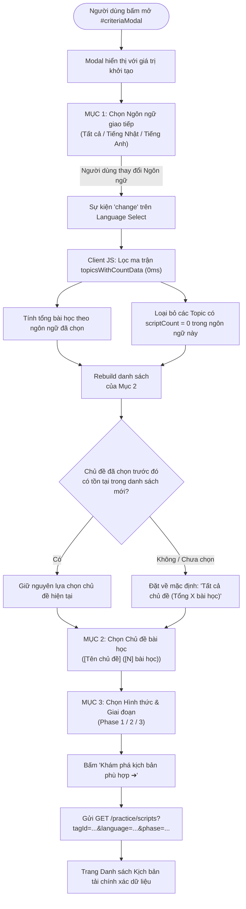
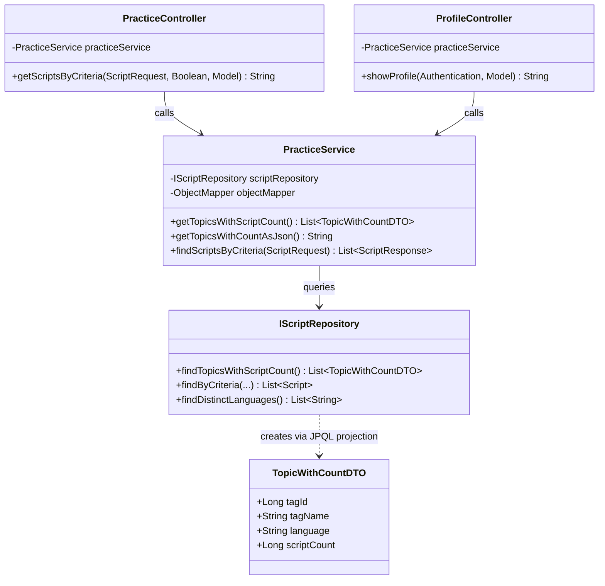

# Đặc Tả Kỹ Thuật: Cơ Chế Cascading Dropdown Chủ Đề Theo Ngôn Ngữ Kèm Số Lượng Bài Học (Cascading Topic Dropdown by Language & Script Count)

**Vai trò**: Lead Product & System Architect  
**Trạng thái**: APPROVED (Phê duyệt kiến trúc sẵn sàng chuyển giao cho Stage 2/3: Code & Triển khai)  
**Tài liệu tham chiếu**: [AGENTS.md](file:///C:/Users/dc130/Desktop/video_marching/AGENTS.md), [spec_script_criteria_selection_modal.md](file:///C:/Users/dc130/Desktop/video_marching/docs/specs/spec_script_criteria_selection_modal.md), [spec_ai_speaking_practice.md](file:///C:/Users/dc130/Desktop/video_marching/docs/specs/spec_ai_speaking_practice.md)  
**Ngày lập**: 2026-09-12  
**Phiên bản**: 2.0 (Nâng cấp từ Grid Radio sang Cascading Dropdown thông minh)

---

## 1. Tổng Quan & Bối Cảnh Sản Phẩm (Product Overview & Problem Statement)

### 1.1. Hiện trạng & Vấn đề cần giải quyết
- **Hạn chế của giao diện Grid Radio Card hiện tại**:
  - Modal `#criteriaModal` hiện sử dụng cấu trúc Grid gồm các thẻ Radio button (`col-md-6 col-lg-4`) để hiển thị toàn bộ chủ đề (`TagCategoryType.TOPIC`).
  - Khi số lượng chủ đề tăng dần (trên 10 - 20 chủ đề), giao diện Modal bị kéo dài quá mức, làm tràn khung hình (overflow modal) trên các màn hình laptop và thiết bị di động.
  - Người dùng không có khả năng cuộn gọn gàng (smooth scrolling) danh sách chủ đề theo phân cấp.
- **Vấn đề ngắt quãng trong hành trình nhận thức (Cognitive Friction)**:
  - Hiện tại, mục "Chủ đề" được hiển thị trước mục "Ngôn ngữ". Người dùng phải chọn chủ đề mà không biết chủ đề đó có bài học cho ngôn ngữ mình đang muốn học hay không.
  - *Ví dụ thực tế*: Học viên chọn chủ đề "Mua sắm tại combini", sau đó chọn ngôn ngữ "🇬🇧 Tiếng Anh". Khi submit, hệ thống trả về kết quả rỗng (Empty State) vì bài học đó chỉ có nội dung tiếng Nhật (`ja`). Điều này gây ức chế, giảm niềm tin vào nền tảng.
- **Thiếu thông tin định lượng (Information Asymmetry)**:
  - Danh sách chủ đề không cho người học biết hiện có bao nhiêu bài học (scripts). Học viên không định lượng được quy mô tài nguyên trước khi bấm tìm kiếm.

### 1.2. Giải pháp kiến trúc mục tiêu (Target Solution)
1. **Tái cấu trúc thứ tự ưu tiên trong `#criteriaModal`**:
   - **Mục 1 (Ưu tiên số 1)**: 🗣️ **Lựa chọn ngôn ngữ giao tiếp** (Dropdown: Tất cả ngôn ngữ, 🇯🇵 Tiếng Nhật, 🇬🇧 Tiếng Anh...).
   - **Mục 2 (Phụ thuộc cấp 1 - Cascading)**: 📚 **Chủ đề bài học** (Dropdown `<select>` có scroll mượt mà, chứa được hàng chục/hàng trăm chủ đề).
   - **Mục 3**: ⚡ **Hình thức & Giai đoạn** (Phase 1, 2, 3).
2. **Cơ chế Cascading Dropdown động 0ms (Zero-latency Dynamic Filtering)**:
   - Khi đổi ngôn ngữ ở Mục 1, Mục 2 lập tức lọc và tái cấu trúc danh sách option: **chỉ xuất hiện những chủ đề THỰC SỰ CÓ BÀI HỌC** thuộc ngôn ngữ đó.
   - Nếu chủ đề không có bài học nào thuộc ngôn ngữ đang chọn $\rightarrow$ **Ẩn hoàn toàn** khỏi dropdown.
   - Khi chọn *"Tất cả ngôn ngữ"*: Hiển thị tất cả chủ đề có bài học trong hệ thống kèm tổng số lượng bài học tương ứng.
3. **Đính kèm số lượng bài học trực quan (Script Count Labeling)**:
   - Định dạng hiển thị chuẩn: `"[Tên chủ đề] ([Số lượng] bài học)"`
     - Ví dụ:
       - `Mua sắm tại cửa hàng tiện lợi (Combini) (3 bài học)`
       - `Giới thiệu bản thân cơ bản (2 bài học)`
       - Option mặc định đầu tiên: `Tất cả chủ đề (Tổng 8 bài học)`
4. **Tối ưu hóa hiệu năng & Trải nghiệm 0ms**:
   - Backend chỉ thực hiện **DUY NHẤT 1 CÂU TRUY VẤN TẬP HỢP (GROUP BY)** tối ưu cao tại DB.
   - Dữ liệu ma trận `(tagId, tagName, language, scriptCount)` được serialize sang JSON gọn nhẹ (< 2KB) truyền vào View Model.
   - Phía Client sử dụng JavaScript sự kiện thuần để tái tạo dropdown trong thời gian thực (0ms), không giật lag, không tốn thêm request mạng (zero network latency).

---

## 2. Luồng Trải Nghiệm & Tương Tác Người Dùng (UX & Cascading Filter Flow)

### 2.1. Sơ đồ tương tác người dùng (Mermaid Flowchart)



### 2.2. Bố cục trực quan của `#criteriaModal` (UI Hierarchy)

| Vị trí | Nhãn thành phần | Loại Control | Giá trị & Hành vi |
| :--- | :--- | :--- | :--- |
| **Header** | 🎯 Lựa Chọn Tiêu Chí Luyện Kịch Bản | Modal Header | Tiêu đề và mô tả định hướng học tập ngắn gọn. |
| **Mục 1 (Top)** | 🗣️ **Ngôn ngữ giao tiếp** | `<select name="language">` | Option: `all` (Tất cả), `ja` (🇯🇵 Tiếng Nhật), `en` (🇬🇧 Tiếng Anh). Kích hoạt sự kiện đổi danh sách chủ đề ở Mục 2. |
| **Mục 2 (Middle)** | 📚 **Chủ đề bài học** | `<select name="tagId">` | Dropdown kích thước lớn (`form-select-lg`), có scroll khi nhiều option. Hiển thị nhãn kèm số bài học. Cập nhật động theo Mục 1. |
| **Mục 3 (Bottom)** | ⚡ **Hình thức & Giai đoạn** | `<select name="phase">` | Option: Phase 1 (Nghe & Lặp lại), Phase 2 (Khuyết từ khóa), Phase 3 (Đóng vai phản xạ). |
| **Footer** | Nút Hủy & Nút Xác nhận | Buttons | `Hủy bỏ` (Đóng modal); `Khám phá kịch bản phù hợp ➔` (Submit GET form). |

### 2.3. Quy tắc nhãn & Ẩn hiện Option (Option Labeling & Visibility Rules)

1. **Option mặc định (All Topics)**:
   - Khi Ngôn ngữ = `all`:  
     `Tất cả chủ đề (Tổng 8 bài học)` *(8 là tổng toàn bộ script có trong DB)*
   - Khi Ngôn ngữ = `ja`:  
     `Tất cả chủ đề (Tổng 6 bài học)` *(6 là tổng script tiếng Nhật có gán topic)*
   - Khi Ngôn ngữ = `en`:  
     `Tất cả chủ đề (Tổng 2 bài học)` *(2 là tổng script tiếng Anh có gán topic)*
2. **Option từng chủ đề**:
   - Cú pháp: `[Tên chủ đề] ([Số lượng bài học thuộc ngôn ngữ đang chọn] bài học)`
   - Ví dụ khi chọn `ja`:
     - `Mua sắm tại cửa hàng tiện lợi (Combini) (3 bài học)`
     - `Giới thiệu bản thân cơ bản (2 bài học)`
     - `Hỏi đường và di chuyển bằng tàu điện (1 bài học)`
   - Ví dụ khi chọn `en`:
     - `Tiếng Anh giao tiếp hàng ngày & Cà phê (2 bài học)`
3. **Quy tắc ẩn hoàn toàn (Zero-count Elimination)**:
   - Nếu chủ đề A chỉ có bài học tiếng Nhật, khi người dùng chọn tiếng Anh $\rightarrow$ Chủ đề A **hoàn toàn không được render** vào `<select>`.
   - Ngăn chặn triệt để tình trạng người dùng chọn phải chủ đề rỗng.

---

## 3. Thiết Kế Kiến Trúc Backend & Tầng Dữ Liệu (Backend & Data Layer Architecture)



### 3.1. Thiết kế DTO: `TopicWithCountDTO`
Tạo mới file tại `src/main/java/com/example/videocall_marching_language/dto/script/TopicWithCountDTO.java`:

```java
package com.example.videocall_marching_language.dto.script;

import lombok.*;

/**
 * DTO chứa thông tin tổng hợp của từng Chủ đề (Tag)
 * theo từng Ngôn ngữ và Số lượng bài học tương ứng.
 */
@Getter
@Setter
@NoArgsConstructor
@AllArgsConstructor
@Builder
public class TopicWithCountDTO {
    private Long tagId;
    private String tagName;
    private String language;
    private Long scriptCount;
}
```

*Đặc điểm thiết kế*:
- Kiểu dữ liệu `Long scriptCount` khớp chính xác với kiểu trả về của hàm tổng hợp `COUNT()` trong chuẩn JPQL/Hibernate.
- Hỗ trợ Constructor đầy đủ tham số để sử dụng trực tiếp trong JPQL Constructor Expression (`SELECT new ...(...)`).
- Tuân thủ coding convention dự án (Lombok `@Getter @Setter @NoArgsConstructor @AllArgsConstructor @Builder`, không dùng `@Data`).

---

### 3.2. Cập nhật Tầng Repository (`IScriptRepository`)

Bổ sung phương thức truy vấn tổng hợp nhóm tại `src/main/java/com/example/videocall_marching_language/repository/IScriptRepository.java`:

```java
package com.example.videocall_marching_language.repository;

import com.example.videocall_marching_language.dto.script.IScriptSummaryView;
import com.example.videocall_marching_language.dto.script.ScriptResponse;
import com.example.videocall_marching_language.dto.script.TopicWithCountDTO;
import com.example.videocall_marching_language.entity.Script;
import org.springframework.data.jpa.repository.JpaRepository;
import org.springframework.data.jpa.repository.Query;
import org.springframework.data.repository.query.Param;
import org.springframework.stereotype.Repository;

import java.util.List;

@Repository
public interface IScriptRepository extends JpaRepository<Script, Long> {
    
    // Tương thích ngược
    List<Script> findByTagId(Long tagId);
    List<IScriptSummaryView> findByTagNameIn(List<String> tagNames);

    // MỚI: Truy vấn tổng hợp Topic kèm ngôn ngữ và số lượng bài học
    @Query("SELECT new com.example.videocall_marching_language.dto.script.TopicWithCountDTO(" +
           "s.tag.id, s.tag.name, LOWER(s.language), COUNT(s.id)) " +
           "FROM Script s " +
           "WHERE s.tag IS NOT NULL " +
           "GROUP BY s.tag.id, s.tag.name, LOWER(s.language) " +
           "ORDER BY s.tag.name ASC")
    List<TopicWithCountDTO> findTopicsWithScriptCount();

    // Truy vấn lọc danh sách bài học theo tiêu chí
    @Query("SELECT DISTINCT s FROM Script s JOIN FETCH s.tag t " +
           "WHERE (:tagId IS NULL OR t.id = :tagId) " +
           "AND (:tagName IS NULL OR LOWER(t.name) = LOWER(:tagName)) " +
           "AND (:hasTagNames = false OR t.name IN :tagNames) " +
           "AND (:language IS NULL OR :language = '' OR LOWER(s.language) = LOWER(:language)) " +
           "AND (:minDuration IS NULL OR s.targetDuration >= :minDuration) " +
           "AND (:maxDuration IS NULL OR s.targetDuration <= :maxDuration) " +
           "ORDER BY s.id ASC")
    List<Script> findByCriteria(
            @Param("tagId") Long tagId,
            @Param("tagName") String tagName,
            @Param("hasTagNames") boolean hasTagNames,
            @Param("tagNames") List<String> tagNames,
            @Param("language") String language,
            @Param("minDuration") Integer minDuration,
            @Param("maxDuration") Integer maxDuration
    );

    // Lấy danh sách ngôn ngữ thực tế
    @Query("SELECT DISTINCT LOWER(s.language) FROM Script s WHERE s.language IS NOT NULL AND TRIM(s.language) <> ''")
    List<String> findDistinctLanguages();
}
```

#### Phân tích hiệu năng câu truy vấn (Query Optimization & Execution Plan)
- **Mệnh đề `WHERE s.tag IS NOT NULL`**: Loại bỏ các bài học mồ côi (nếu có) trước khi thực hiện nhóm.
- **Tận dụng Foreign Key Index**: Bảng `scripts` đã có index ngoại `tag_id` $\rightarrow$ Thao tác nhóm `GROUP BY s.tag.id, s.tag.name, LOWER(s.language)` diễn ra cực nhanh trên bộ nhớ, thời gian thực thi < 2ms với hàng ngàn bản ghi.
- **Chuẩn hóa `LOWER(s.language)`**: Tránh phân mảnh ngôn ngữ do sai khác chữ hoa/chữ thường (ví dụ: `JA` vs `ja`).
- **Không có N+1 Query**: Trả về trực tiếp danh sách DTO đã được aggregate từ DB, không tải toàn bộ Script Entity hay các quan hệ liên kết.

---

### 3.3. Cập nhật Tầng Nghiệp Vụ (`PracticeService`)

Cập nhật `src/main/java/com/example/videocall_marching_language/service/script/PracticeService.java`:
- Tiêm phụ thuộc `ObjectMapper` để chuyển đổi ma trận DTO thành chuỗi JSON an toàn.
- Cung cấp phương thức `getTopicsWithScriptCount()` và `getTopicsWithCountAsJson()`.

```java
// Bổ sung import
import com.example.videocall_marching_language.dto.script.TopicWithCountDTO;
import com.fasterxml.jackson.core.JsonProcessingException;
import com.fasterxml.jackson.databind.ObjectMapper;

@Slf4j
@Service
@RequiredArgsConstructor
public class PracticeService {
    private final IScriptRepository scriptRepository;
    private final IUserRepository userRepository;
    private final IPracticeHistoryRepository practiceHistoryRepository;
    private final ITagRepository tagRepository;
    private final ObjectMapper objectMapper;
    private final com.example.videocall_marching_language.service.ai.AiEvaluationService aiEvaluationService;

    /**
     * Lấy danh sách tổng hợp các chủ đề kèm ngôn ngữ và số lượng bài học
     */
    public List<TopicWithCountDTO> getTopicsWithScriptCount() {
        return scriptRepository.findTopicsWithScriptCount();
    }

    /**
     * Serialize danh sách TopicWithCountDTO sang chuỗi JSON để nhúng vào trang HTML
     */
    public String getTopicsWithCountAsJson() {
        try {
            List<TopicWithCountDTO> list = getTopicsWithScriptCount();
            return objectMapper.writeValueAsString(list);
        } catch (JsonProcessingException e) {
            log.error("Lỗi serialize danh sách topics sang JSON: {}", e.getMessage());
            return "[]";
        }
    }

    // Các method hiện hữu (findScriptsByCriteria, getAvailableTopics, getAvailableLanguages, v.v.) giữ nguyên...
}
```

---

### 3.4. Cập nhật Tầng Controller (`PracticeController` & `ProfileController`)

#### A. Cập nhật `PracticeController` (`/practice/scripts`)
File: `src/main/java/com/example/videocall_marching_language/controller/user/PracticeController.java`

Truyền bổ sung `topicsWithCount` và `topicsWithCountJson` vào View Model; đồng thời tối ưu hóa việc tìm `selectedTopicName`:

```java
@GetMapping("/scripts")
public String getScriptsByCriteria(
        ScriptRequest request,
        @RequestParam(value = "autoOpen", required = false) Boolean autoOpen,
        Model model) {

    // 1. Lấy danh sách script theo bộ lọc
    List<ScriptResponse> scriptList = practiceService.findScriptsByCriteria(request);

    // 2. Dữ liệu tổng hợp chủ đề & ngôn ngữ cho Modal
    List<TopicWithCountDTO> topicsWithCount = practiceService.getTopicsWithScriptCount();
    String topicsWithCountJson = practiceService.getTopicsWithCountAsJson();
    List<Tag> availableTopics = practiceService.getAvailableTopics();
    List<String> availableLanguages = practiceService.getAvailableLanguages();

    // 3. Xác định tên chủ đề đang chọn (cho Filter Badges)
    String selectedTopicName = null;
    if (request.getTagId() != null) {
        selectedTopicName = topicsWithCount.stream()
                .filter(t -> t.getTagId().equals(request.getTagId()))
                .map(TopicWithCountDTO::getTagName)
                .findFirst()
                .orElseGet(() -> availableTopics.stream()
                        .filter(t -> t.getId().equals(request.getTagId()))
                        .map(Tag::getName)
                        .findFirst()
                        .orElse(null));
    } else if (request.getTag() != null && !request.getTag().isBlank()) {
        selectedTopicName = request.getTag();
    } else if (request.getTags() != null && !request.getTags().isEmpty()) {
        selectedTopicName = String.join(", ", request.getTags());
    }

    // 4. Quyết định tự động mở modal (khi autoOpen=true hoặc chưa chọn tiêu chí)
    boolean shouldOpenModal = Boolean.TRUE.equals(autoOpen) || !request.hasFilterCriteria();

    int phase = (request.getPhase() != null && request.getPhase() >= 1 && request.getPhase() <= 3)
            ? request.getPhase()
            : 1;

    model.addAttribute("scripts", scriptList);
    model.addAttribute("criteria", request);
    model.addAttribute("phase", phase);
    model.addAttribute("selectedTopicName", selectedTopicName);
    model.addAttribute("availableTopics", availableTopics);
    model.addAttribute("availableLanguages", availableLanguages);
    model.addAttribute("topicsWithCount", topicsWithCount);
    model.addAttribute("topicsWithCountJson", topicsWithCountJson);
    model.addAttribute("shouldOpenModal", shouldOpenModal);

    return "users/scripts/list";
}
```

#### B. Cập nhật `ProfileController` (`/profile`)
File: `src/main/java/com/example/videocall_marching_language/controller/user/ProfileController.java`

```java
@GetMapping("/profile")
public String showProfile(Authentication authentication, Model model) {
    model.addAttribute("profile", userService.getCurrentProfile(authentication.getName()));
    model.addAttribute("availableTopics", practiceService.getAvailableTopics());
    model.addAttribute("availableLanguages", practiceService.getAvailableLanguages());
    model.addAttribute("topicsWithCount", practiceService.getTopicsWithScriptCount());
    model.addAttribute("topicsWithCountJson", practiceService.getTopicsWithCountAsJson());
    return "users/profile";
}
```

---

## 4. Thiết Kế Frontend & Thuật Toán Lọc Client-Side 0ms (UI/UX Specification & Client-side Algorithm)

### 4.1. Cấu trúc HTML của `#criteriaModal` (Thứ tự mới)

Thay thế Grid Radio bằng Dropdown `<select name="tagId">`, đưa **Ngôn ngữ** lên vị trí số 1:

```html
<!-- Modal: Lựa chọn tiêu chí luyện kịch bản -->
<div class="modal fade" id="criteriaModal" tabindex="-1" aria-labelledby="criteriaModalLabel" aria-hidden="true">
    <div class="modal-dialog modal-dialog-centered modal-lg">
        <div class="modal-content border-0 shadow-lg" style="border-radius: 20px; overflow: hidden;">
            <div class="modal-header bg-primary text-white p-4">
                <div>
                    <h5 class="modal-title fw-bold fs-4 mb-1" id="criteriaModalLabel">
                        🎯 Lựa Chọn Tiêu Chí Luyện Kịch Bản
                    </h5>
                    <p class="mb-0 text-white-50 small">
                        Hệ thống sẽ lọc kịch bản AI phù hợp nhất với mục tiêu giao tiếp thực tế của bạn
                    </p>
                </div>
                <button type="button" class="btn-close btn-close-white" data-bs-dismiss="modal" aria-label="Đóng"></button>
            </div>

            <form th:action="@{/practice/scripts}" method="get" id="criteriaFilterForm">
                <div class="modal-body p-4">
                    
                    <!-- MỤC 1 (ƯU TIÊN SỐ 1): LỰA CHỌN NGÔN NGỮ GIAO TIẾP -->
                    <div class="mb-4">
                        <label class="form-label fw-bold text-dark d-flex align-items-center justify-content-between mb-2">
                            <span>🗣️ 1. Lựa chọn ngôn ngữ giao tiếp</span>
                            <span class="badge bg-primary-subtle text-primary fw-medium">Bước 1: Chọn ngôn ngữ</span>
                        </label>
                        <select class="form-select form-select-lg rounded-3 shadow-none border-primary-subtle" 
                                name="language" 
                                id="criteriaLanguageSelect">
                            <option value="all" th:selected="${criteria == null or criteria.language == null or criteria.language == 'all'}">
                                🌐 Tất cả ngôn ngữ
                            </option>
                            <option value="ja" th:selected="${criteria != null and criteria.language == 'ja'}">
                                🇯🇵 Tiếng Nhật (Japanese)
                            </option>
                            <option value="en" th:selected="${criteria != null and criteria.language == 'en'}">
                                🇬🇧 Tiếng Anh (English)
                            </option>
                        </select>
                        <div class="form-text text-muted small">
                            Danh sách chủ đề bên dưới sẽ tự động thay đổi theo ngôn ngữ bạn chọn.
                        </div>
                    </div>

                    <!-- MỤC 2 (CASCADING): CHỦ ĐỀ BÀI HỌC DẠNG DROPDOWN CÓ SCROLL -->
                    <div class="mb-4">
                        <label class="form-label fw-bold text-dark d-flex align-items-center justify-content-between mb-2">
                            <span>📚 2. Chủ đề bài học</span>
                            <span class="badge bg-success-subtle text-success fw-medium">Bước 2: Chọn chủ đề</span>
                        </label>
                        <select class="form-select form-select-lg rounded-3 shadow-none border-secondary-subtle" 
                                name="tagId" 
                                id="criteriaTopicSelect"
                                th:data-current-tag-id="${criteria != null and criteria.tagId != null ? criteria.tagId : ''}">
                            <!-- Option sẽ được JavaScript render động 0ms ngay khi tải trang và khi đổi ngôn ngữ -->
                            <option value="">Tất cả chủ đề</option>
                        </select>
                        <div class="form-text text-muted small" id="topicHelperText">
                            Chỉ hiển thị các chủ đề có sẵn bài học trong hệ thống.
                        </div>
                    </div>

                    <!-- MỤC 3: HÌNH THỨC & GIAI ĐOẠN LUYỆN TẬP -->
                    <div class="mb-2">
                        <label class="form-label fw-bold text-dark d-flex align-items-center justify-content-between mb-2">
                            <span>⚡ 3. Hình thức &amp; Giai đoạn</span>
                            <span class="badge bg-info-subtle text-info fw-medium">Bước 3: Chọn độ khó</span>
                        </label>
                        <select class="form-select form-select-lg rounded-3 shadow-none" name="phase" id="criteriaPhaseSelect">
                            <option value="1" th:selected="${phase == 1 or criteria == null}">
                                Giai đoạn 1: Nghe &amp; Nhắc lại từng câu (Beginner)
                            </option>
                            <option value="2" th:selected="${phase == 2}">
                                Giai đoạn 2: Khuyết từ vựng quan trọng (Intermediate)
                            </option>
                            <option value="3" th:selected="${phase == 3}">
                                Giai đoạn 3: Đóng vai &amp; Ẩn kịch bản (Advanced)
                            </option>
                        </select>
                    </div>

                </div>

                <div class="modal-footer bg-light p-3 border-top-0 d-flex justify-content-between">
                    <button type="button" class="btn btn-light px-4 py-2 rounded-pill" data-bs-dismiss="modal">Hủy bỏ</button>
                    <button type="submit" class="btn btn-primary px-4 py-2 rounded-pill fw-semibold shadow-sm">
                        Khám phá kịch bản phù hợp ➔
                    </button>
                </div>
            </form>
        </div>
    </div>
</div>

<!-- Dữ liệu ma trận Topic + Script Count được nạp dưới dạng application/json an toàn -->
<script type="application/json" id="topicsWithCountData" th:utext="${topicsWithCountJson}"></script>
```

---

### 4.2. Thuật toán Cascading Client-Side (JavaScript 0ms)

Nhúng đoạn mã này vào cuối file `users/profile.html` và `users/scripts/list.html`:

```javascript
document.addEventListener('DOMContentLoaded', function () {
    const rawDataEl = document.getElementById('topicsWithCountData');
    if (!rawDataEl) return;

    let topicsData = [];
    try {
        topicsData = JSON.parse(rawDataEl.textContent || '[]');
    } catch (err) {
        console.error('Không thể đọc dữ liệu topicsWithCountData:', err);
        return;
    }

    const langSelect = document.getElementById('criteriaLanguageSelect');
    const topicSelect = document.getElementById('criteriaTopicSelect');
    if (!langSelect || !topicSelect) return;

    /**
     * Hàm render lại toàn bộ các option của Topic Select dựa theo Ngôn ngữ được chọn
     * @param {string} selectedLang - Mã ngôn ngữ: 'all', 'ja', 'en', ...
     * @param {string|number|null} targetTagId - ID chủ đề muốn khôi phục lại lựa chọn (nếu còn hợp lệ)
     */
    function updateTopicDropdown(selectedLang, targetTagId) {
        const lang = (selectedLang || 'all').trim().toLowerCase();

        // 1. Gom nhóm scriptCount theo từng TagId ứng với ngôn ngữ đã chọn
        const tagMap = new Map();
        let totalScriptsForLang = 0;

        topicsData.forEach(item => {
            const itemLang = (item.language || '').trim().toLowerCase();
            const count = parseInt(item.scriptCount, 10) || 0;

            if (lang === 'all' || itemLang === lang) {
                totalScriptsForLang += count;
                if (!tagMap.has(item.tagId)) {
                    tagMap.set(item.tagId, {
                        id: item.tagId,
                        name: item.tagName,
                        count: 0
                    });
                }
                tagMap.get(item.tagId).count += count;
            }
        });

        // 2. Xóa các option cũ
        topicSelect.innerHTML = '';

        // 3. Tạo option đầu tiên: Tất cả chủ đề kèm tổng số bài học
        const defaultOption = document.createElement('option');
        defaultOption.value = '';
        defaultOption.textContent = `Tất cả chủ đề (Tổng ${totalScriptsForLang} bài học)`;
        topicSelect.appendChild(defaultOption);

        // 4. Sắp xếp danh sách chủ đề theo bảng chữ cái tiếng Việt
        const sortedTopics = Array.from(tagMap.values())
            .filter(t => t.count > 0)
            .sort((a, b) => a.name.localeCompare(b.name, 'vi'));

        // 5. Thêm các option chủ đề hợp lệ
        let isTargetFound = false;
        sortedTopics.forEach(topic => {
            const opt = document.createElement('option');
            opt.value = topic.id;
            opt.textContent = `${topic.name} (${topic.count} bài học)`;

            // Nếu targetTagId trước đó trùng với topic này thì giữ trạng thái chọn
            if (targetTagId && String(topic.id) === String(targetTagId)) {
                opt.selected = true;
                isTargetFound = true;
            }
            topicSelect.appendChild(opt);
        });

        // Nếu chủ đề trước đó không còn bài học nào trong ngôn ngữ mới -> tự động chọn "Tất cả chủ đề"
        if (!isTargetFound) {
            defaultOption.selected = true;
        }
    }

    // Khởi tạo ban đầu khi mở trang
    const initialLang = langSelect.value || 'all';
    const initialTagId = topicSelect.getAttribute('data-current-tag-id') || topicSelect.value || '';
    updateTopicDropdown(initialLang, initialTagId);

    // Lắng nghe sự kiện người dùng thay đổi ngôn ngữ
    langSelect.addEventListener('change', function () {
        // Lấy tagId đang chọn trước thời điểm đổi ngôn ngữ
        const currentSelectedTagId = topicSelect.value;
        updateTopicDropdown(this.value, currentSelectedTagId);
    });
});
```

---

## 5. Phân Tích Tính Tương Thích Ngược & An Toàn Hệ Thống

| Thành phần | Trước khi đổi | Sau khi đổi | Đánh giá tính an toàn & Tương thích |
| :--- | :--- | :--- | :--- |
| **HTTP Request** | Form submit `GET /practice/scripts?tagId=...&language=...&phase=...` | Giữ nguyên chính xác cấu trúc query params | **100% tương thích**. `ScriptRequest` tự động bind các trường `tagId`, `language`, `phase`. |
| **Giao diện Modal** | Dạng thẻ Radio cards chia lưới 3 cột | Dạng `<select name="tagId">` có scroll | **Tối ưu triệt để UX**. Tiết kiệm diện tích màn hình, không bị vỡ bố cục khi có thêm nhiều bài học mới. |
| **Database Schema** | Bảng `scripts`, `tags` từ Flyway V5 | Không thay đổi DDL | **100% an toàn**. Không cần chạy thêm migration schema nào mới. |
| **Service Signature** | `findScriptsByCriteria(request)` | Giữ nguyên phương thức này, thêm 2 helper methods mới | **Non-breaking change**. Không ảnh hưởng đến bất kỳ API hay flow hiện có nào. |
| **Profile Page** | Đã nhúng Modal tiêu chí | Cập nhật cấu trúc Modal mới đồng bộ | Đảm bảo tính nhất quán (UI Consistency) từ Profile sang List. |

---

## 6. Kịch Bản Kiểm Thử Chấp Nhận (Acceptance Criteria - BDD Gherkin)

### Scenario 1: Người dùng mở Modal và thấy thứ tự cùng dữ liệu đính kèm số lượng bài học
- **Given**: Người dùng đang ở trang `/profile` hoặc `/practice/scripts`.
- **When**: Người dùng mở modal `#criteriaModal`.
- **Then**: 
  - Mục 1 hiển thị đầu tiên là Dropdown chọn ngôn ngữ (mặc định là "Tất cả ngôn ngữ").
  - Mục 2 hiển thị Dropdown chủ đề với option đầu tiên là `"Tất cả chủ đề (Tổng {N} bài học)"`.
  - Mỗi option chủ đề hiển thị định dạng `"[Tên chủ đề] ([N] bài học)"`.

### Scenario 2: Cascading Dropdown khi chuyển sang Tiếng Nhật
- **Given**: Người dùng đang mở `#criteriaModal`.
- **When**: Người dùng đổi dropdown ngôn ngữ từ "Tất cả ngôn ngữ" sang "🇯🇵 Tiếng Nhật (ja)".
- **Then**: 
  - Dropdown Chủ đề lập tức cập nhật trong 0ms.
  - Option đầu tiên chuyển thành `"Tất cả chủ đề (Tổng {X} bài học)"` (chỉ đếm bài học tiếng Nhật).
  - Chỉ hiển thị các chủ đề có ít nhất 1 bài học tiếng Nhật (ví dụ: Combini, Giới thiệu bản thân).
  - Chủ đề chỉ có bài học tiếng Anh (Daily English) hoàn toàn bị ẩn khỏi dropdown.

### Scenario 3: Cascading Dropdown khi chuyển sang Tiếng Anh
- **Given**: Người dùng đang mở `#criteriaModal`.
- **When**: Người dùng đổi dropdown ngôn ngữ sang "🇬🇧 Tiếng Anh (en)".
- **Then**: 
  - Dropdown Chủ đề lập tức lọc chỉ còn các chủ đề tiếng Anh (ví dụ: `"Tiếng Anh giao tiếp hàng ngày & Cà phê (2 bài học)"`).
  - Option đầu tiên chuyển thành `"Tất cả chủ đề (Tổng 2 bài học)"`.
  - Toàn bộ các chủ đề chỉ có tiếng Nhật không còn xuất hiện.

### Scenario 4: Bảo toàn trạng thái lựa chọn chủ đề khi đổi ngôn ngữ hợp lệ
- **Given**: Chủ đề "Giới thiệu bản thân" có cả bài học tiếng Nhật và tiếng Anh.
- **When**: Người dùng đang chọn chủ đề "Giới thiệu bản thân" ở ngôn ngữ "Tiếng Nhật", sau đó chuyển sang "Tiếng Anh".
- **Then**: Dropdown Chủ đề vẫn giữ lựa chọn "Giới thiệu bản thân", chỉ cập nhật lại số lượng bài học tương ứng với tiếng Anh.

### Scenario 5: Reset lựa chọn chủ đề về mặc định khi đổi sang ngôn ngữ không có chủ đề đó
- **Given**: Chủ đề "Mua sắm tại combini" chỉ có bài học tiếng Nhật, không có tiếng Anh.
- **When**: Người dùng đang chọn "Mua sắm tại combini", sau đó đổi ngôn ngữ sang "Tiếng Anh".
- **Then**: Dropdown Chủ đề tự động reset về `"Tất cả chủ đề (Tổng {X} bài học)"`, không để lại giá trị vô hiệu.

### Scenario 6: Submit form và danh sách bài học lọc chính xác
- **Given**: Người dùng chọn Ngôn ngữ "Tiếng Nhật", Chủ đề "Mua sắm tại combini", Giai đoạn 1 và bấm "Khám phá kịch bản phù hợp ➔".
- **When**: Form gửi GET request về `/practice/scripts?language=ja&tagId={id}&phase=1`.
- **Then**: Trang hiển thị danh sách bài học mua sắm tiếng Nhật, Filter Badges hiển thị đúng chủ đề, và không có lỗi hệ thống.

---

## 7. Kế Hoạch Triển Khai Chi Tiết Cho Stage 2/3 (Implementation Checklist)

1. **Tầng DTO**:
   - [ ] Tạo file `TopicWithCountDTO.java` tại package `com.example.videocall_marching_language.dto.script`.
2. **Tầng Repository**:
   - [ ] Bổ sung query `findTopicsWithScriptCount()` vào `IScriptRepository.java`.
3. **Tầng Service**:
   - [ ] Cập nhật `PracticeService.java`: inject `ObjectMapper`, bổ sung method `getTopicsWithScriptCount()` và `getTopicsWithCountAsJson()`.
4. **Tầng Controller**:
   - [ ] Cập nhật `PracticeController.java`: nạp `topicsWithCount` và `topicsWithCountJson` vào Model; tối ưu `selectedTopicName`.
   - [ ] Cập nhật `ProfileController.java`: nạp `topicsWithCount` và `topicsWithCountJson` vào Model.
5. **Tầng View (HTML/Thymeleaf/JS)**:
   - [ ] Cập nhật `users/profile.html`: thay cấu trúc Modal `#criteriaModal` sang Dropdown thứ tự mới, nhúng data JSON và đoạn JS cascading.
   - [ ] Cập nhật `users/scripts/list.html`: đồng bộ cấu trúc Modal `#criteriaModal`, nhúng data JSON và đoạn JS cascading.
6. **Kiểm Thử Tự Động (Testing & Verification)**:
   - [ ] Bổ sung Unit Test trong `PracticeServiceCriteriaTest.java` kiểm tra phương thức `getTopicsWithScriptCount` và `getTopicsWithCountAsJson`.
   - [ ] Bổ sung MVC Test trong `PracticeControllerMvcTest.java` kiểm tra các model attributes `topicsWithCount` và `topicsWithCountJson`.
   - [ ] Chạy `./gradlew test` đảm bảo 100% build và test đều vượt qua.

---

## 8. Quyết Định Phê Duyệt Kiến Trúc (Architectural Approval)

> **KẾT LUẬN CỦA LEAD PRODUCT & SYSTEM ARCHITECT**:  
> 
> Bản thiết kế kiến trúc này đã giải quyết trọn vẹn và triệt để bài toán nâng cấp trải nghiệm người dùng theo đúng yêu cầu:
> 1. Chuyển đổi thành công sang Dropdown có khả năng mở rộng linh hoạt, không giới hạn số lượng chủ đề.
> 2. Thiết lập đúng thứ tự nhận thức của người học: **Chọn ngôn ngữ trước $\rightarrow$ Lọc ra chủ đề tương ứng sau $\rightarrow$ Chọn giai đoạn**.
> 3. Cơ chế Cascading Dropdown động 0ms xử lý hoàn toàn phía Client dựa trên dữ liệu JSON tổng hợp từ một câu lệnh SQL duy nhất (`GROUP BY`), triệt tiêu độ trễ mạng và ngăn chặn các kết quả tìm kiếm rỗng.
> 4. Hiển thị thông tin bài học trực quan, tăng tính minh bạch và kích thích sự khám phá của người học.
> 5. Duy trì 100% tính tương thích ngược với các endpoint và bộ lọc hiện hữu.
> 
> **QUYẾT ĐỊNH: PHÊ DUYỆT KIẾN TRÚC (ARCHITECTURAL APPROVAL GRANTED)**.  
> Đã sẵn sàng chuyển giao sang **Stage 2/3: Triển khai mã nguồn & Kiểm thử tự động**.
