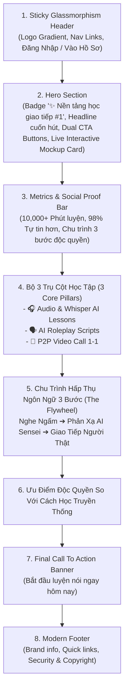

# Đặc Tả Kiến Trúc: Tái Thiết Kế Giao Diện Frontend Chuẩn Quốc Tế, Landing Page & Mobile-First Với Bootstrap 5
## (Modern Global UI/UX Redesign, International SaaS Landing Page & Mobile-First Architecture)

**Vai trò**: Lead Product & System Architect  
**Trạng thái**: PROPOSED (Trình phê duyệt kiến trúc - Chuẩn bị triển khai theo quy trình Agile)  
**Tài liệu tham chiếu**: [AGENTS.md](file:///C:/Users/dc130/Desktop/video_marching/AGENTS.md), [spec_audio_and_p2p_criteria_standardization.md](file:///C:/Users/dc130/Desktop/video_marching/docs/specs/spec_audio_and_p2p_criteria_standardization.md)  
**Ngày lập**: 2026-09-12  
**Phiên bản**: 1.0  

---

## 1. Mục Tiêu Thiết Kế & Tiêu Chuẩn UI/UX Quốc Tế (Product Vision & Design System)

### 1.1. Bối cảnh & Điểm nghẽn giao diện hiện tại
- **Thiếu Landing Page**: Người dùng truy cập root `/` chưa có trang giới thiệu thương hiệu và hệ sinh thái học tập đẳng cấp quốc tế.
- **Phông chữ & Typography chưa thống nhất**: Một số trang dùng `Segoe UI`, một số dùng `Plus Jakarta Sans` với cỡ chữ và khoảng cách (line-height) chưa chuẩn hóa.
- **Trải nghiệm Mobile-First chưa tối ưu**: Một số bảng điều khiển (`#setup-panel`, video layout, modal selection) hiển thị trên màn hình điện thoại (< 576px) còn bị co cụm hoặc nút bấm nhỏ hơn tiêu chuẩn ngón tay chạm (touch target < 44px).
- **Thanh điều hướng (Navbar) thiếu tính liên kết**: Mỗi trang (Profile, Scripts, Audio, Video Call) có header riêng biệt, chưa có thanh Navigation chung mượt mà, hỗ trợ chuyển đổi nhanh.

### 1.2. Bộ Quy Chuẩn Thiết Kế Quốc Tế (Design System Tokens)
1. **Typography**:
   - Phông chữ chủ đạo: **Plus Jakarta Sans** (Google Fonts: 400, 500, 600, 700, 800) – phông chữ hình học hiện đại hàng đầu được sử dụng bởi các sản phẩm EdTech / SaaS toàn cầu.
   - Hierarchy: H1 (2.25rem - 2.75rem, font-weight: 800, tracking: -0.03em), H2 (1.75rem - 2rem, 700), Body (0.95rem - 1.05rem, line-height: 1.6).
2. **Hệ Bảng Màu (Color Palette - Modern Indigo & Emerald)**:
   - Primary: Indigo 600 (`#4f46e5`), Hover: Indigo 700 (`#4338ca`), Light: Indigo 50 (`#eef2ff`).
   - Accent / AI Feature: Gradient Gradient Violet-to-Pink (`linear-gradient(135deg, #6366f1, #ec4899)`).
   - Success / Output: Emerald 500 (`#10b981`), Light: Emerald 50 (`#ecfdf5`).
   - Warning / Level: Amber 500 (`#f59e0b`), Light: Amber 50 (`#fef3c7`).
   - Neutral / Background: Light (`#f8fafc`), Surface Card (`#ffffff`), Border (`#e2e8f0`), Text Main (`#0f172a`), Text Muted (`#64748b`).
3. **Quy tắc 8pt Grid & Bo Góc Hiện Đại**:
   - Spacing: 4px, 8px, 16px, 24px, 32px, 48px, 64px.
   - Border-radius: Thẻ (`rounded-4`, 16px - 20px), Nút (`rounded-pill` hoặc `rounded-3`, 12px).
   - Shadows: `shadow-sm` cho thẻ thông thường, `shadow-lg` cho modal/dropdown, hiệu ứng hover nhấc nhẹ (`translateY(-4px)` kèm shadow đổi màu nhẹ).
4. **Mobile-First Principles**:
   - Breakpoints: Base (`< 576px`), SM (`≥ 576px`), MD (`≥ 768px`), LG (`≥ 992px`), XL (`≥ 1200px`).
   - Mọi nút bấm và control có chiều cao tối thiểu 44px.
   - Thanh lọc (Filter pills) hỗ trợ vuốt ngang (`overflow-x: auto`) mượt mà trên điện thoại.
   - Thẻ hiển thị 1 cột trên mobile và tự động mở rộng 2-3 cột trên tablet/desktop.

---

## 2. Kiến Trúc Trang Landing Page Đẳng Cấp Quốc Tế (`landing.html`)

Được đặt tại endpoint `/` (công khai cho tất cả khách truy cập):

---

## 3. Tái Thiết Kế & Chuẩn Hóa Toàn Diện Các Trang Người Dùng

### 3.1. Thanh Điều Hướng Toàn Hệ Thống (Universal Header Navbar)
Xây dựng Thymeleaf Fragment hoặc tích hợp đồng bộ Navbar trên các trang:
- Logo thương hiệu: Chữ `Marching Language` có biểu tượng gradient sống động.
- Navigation links:
  - 🏠 **Trang Chủ** (`/`)
  - 🗣️ **Luyện Scripts** (`/practice/scripts`)
  - 🎧 **Luyện Audio** (`/practice/audio-lessons`)
  - 👥 **Ghép Đôi P2P** (`/video-call`)
- Khu vực tài khoản:
  - Nếu đã đăng nhập: Avatar tròn, tên người dùng, nút **Hồ sơ** (`/profile`) và nút **Đăng xuất**.
  - Nếu chưa đăng nhập: Nút **Đăng nhập** (`/login`) với Google OIDC.

### 3.2. Chuẩn hóa Trang Cá Nhân (`users/profile.html`)
- Header/Hero cá nhân tinh gọn, hiện đại: Avatar lớn với viền gradient, tên, email, role badge.
- Dashboard thẻ tóm tắt (Grid 3 thẻ):
  - Điểm tin cậy (Trust Score) với thanh tiến độ trực quan.
  - Mô hình AI đang kích hoạt (Google Gemini / Groq Qwen) với badge nổi bật.
  - Cấu hình API Key (Mã hóa an toàn).
- **Bộ 3 Thẻ Trải Nghiệm Học Tập (Experience Cards)**:
  - Thẻ 1: 🎯 **Luyện Scripts AI** (Mở Modal chọn tiêu chí).
  - Thẻ 2: 🎧 **Luyện Audio & AI Lesson** (Mở Modal chọn bài nghe).
  - Thẻ 3: 👥 **Phòng Gọi P2P 1-1** (Mở Modal ghép đôi trực tiếp).

### 3.3. Chuẩn hóa Danh Sách Kịch Bản (`users/scripts/list.html`) & Audio (`users/audio_lessons/list.html`)
- Khung tìm kiếm & Filter Bar bo tròn hiện đại, hiển thị badges rực rỡ, hỗ trợ cuộn ngang linh hoạt trên smartphone.
- Thẻ bài học (Cards) hiển thị đầy đủ: Tag chủ đề, Trình độ (JLPT/CEFR), Ngôn ngữ, Thời lượng và nút hành động to rõ ràng.

### 3.4. Chuẩn hóa Phòng Gọi P2P Video Call (`users/video_call.html`)
- Mobile-First Stepper: Khung chọn tiêu chí dạng 4 bước chia lưới responsive, hỗ trợ chọn nhanh trên màn hình cảm ứng.
- Khung Video Call:
  - Trên Mobile portrait: 2 khung video xếp dọc (Local ở trên, Remote ở dưới) với tỷ lệ 16:9 sắc nét.
  - Trên Desktop: 2 khung video đặt ngang hàng song song, thanh điều khiển nổi (Floating action controls: Mic, Cam, Sổ tay Phao cứu sinh, Rời phòng).

---

## 4. Kế Hoạch Triển Khai Agile 5 Stages

- **Stage 1 (Sprint Planning & Architecture)**: Hoàn thiện Spec kiến trúc UI/UX và thiết kế Landing Page (tài liệu này).
- **Stage 2 (Backend Routing)**: Thêm route `/` trong `WebController.java`, cập nhật cấu hình `SecurityConfig.java`.
- **Stage 3 (Frontend & UI/UX Engineering)**:
  - Tạo `landing.html` với chuẩn Bootstrap 5, Plus Jakarta Sans, hiệu ứng glassmorphism và responsive mobile-first.
  - Cập nhật CSS dùng chung `src/main/resources/static/css/style.css`.
  - Đồng bộ Navbar và typography trên `profile.html`, `scripts/list.html`, `audio_lessons/list.html`, `video_call.html`.
- **Stage 4 (QA & Test Automation)**:
  - Viết test MVC cho route `/` và kiểm tra toàn bộ luồng responsive.
  - Chạy `./gradlew test` và `./gradlew build` đảm bảo 100% xanh.
- **Stage 5 (Sprint Review & Delivery)**: Tổng kết nghiệm thu toàn diện.
