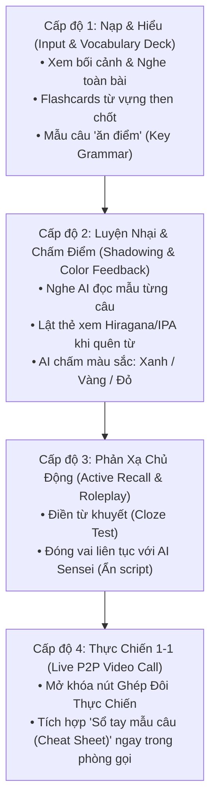

# Thiết Kế Giao Diện & Luồng Học Tối Ưu Hấp Thụ Kiến Thức (Learner Absorption UX Flow)

## 1. Mục Tiêu (Objective)
Đảm bảo người học **hấp thụ tối đa từ vựng, ngữ pháp, ngữ điệu và phản xạ** theo mô hình sư phạm ngôn ngữ thực chứng (Krashen Comprehension Input + Shadowing + Retrieval Practice) **trước khi bước vào phòng gọi video thực chiến (P2P)** với người khác.

---

## 2. Vấn Đề Thực Tế Của Người Học (Current Pain Points)
1. **Thiếu giai đoạn nạp (Input Phase):** Người học vừa vào bài là bị yêu cầu bật mic nói ngay, chưa kịp hiểu nghĩa toàn bài, cấu trúc câu hay từ mới, dẫn đến bỡ ngỡ.
2. **Quá tải nhận thức (Cognitive Overload):** Vừa phải nghĩ nội dung, vừa phải nhớ cách phát âm, vừa lo sợ nói sai trước người lạ.
3. **Thiếu "phao cứu sinh" (Safety Net):** Khi vào phòng gọi video thật, nếu bị run hoặc quên từ, người học sẽ bị "đứng hình" (freeze), dẫn đến trải nghiệm cuộc gọi thất bại.

---

## 3. Kiến Trúc Luồng Học 4 Cấp Độ (The 4-Step Mastery Cycle)

---

## 4. Chi Tiết Thiết Kế Giao Diện (UI/UX Redesign)

### 4.1. Trang Chi Tiết Kịch Bản (`learn.html`)
Giao diện được tái cấu trúc thành 3 Tab học tập thông minh:

1. **Tab 1: 📖 NẠP KIẾN THỨC (Study Deck - Input)**
   - **Tóm tắt bối cảnh:** Vai trò của bạn, tình huống diễn ra ở đâu.
   - **Nghe toàn bài (Full Audio Player):** Nút nghe toàn bộ hội thoại với giọng đọc AI chuẩn bản xứ.
   - **Thẻ từ vựng cốt lõi (Key Vocabulary Cards):** Kanji + Hiragana + Nghĩa tiếng Việt + Nút phát âm từng từ.
   - **Mẫu câu đắt giá (Power Patterns):** 1-2 mẫu câu quan trọng nhất của bài kèm mẹo sử dụng.
   - **Nút hành động:** *"Tôi đã hiểu, bắt đầu Luyện phát âm ➔"*

2. **Tab 2: 🎙️ LUYỆN NÓI CÙNG AI (3-Phase Practice)**
   - **Thanh đo độ sẵn sàng (Readiness Progress Bar):** Tăng dần theo tỷ lệ hoàn thành (0% ➔ 100%).
   - **Thẻ câu thoại tương tác (Interactive Sentence Card):**
     - *Mặt trước:* Câu gốc Kanji/Romaji + Bản dịch tiếng Việt.
     - *Mặt sau (Lật khi quên từ):* Toàn bộ phiên âm Hiragana (hoặc IPA) cỡ chữ to, rõ nét.
     - *Nút nghe phát âm mẫu (Audio).*
   - **Chấm điểm màu sắc trực quan (Color Feedback):**
     - 🟢 **Xanh lá (≥ 90%):** Hoàn hảo! Tự động chuyển câu.
     - 🟡 **Vàng (70 - 89%):** Tương đối tốt, hiện từ phát âm chưa rõ.
     - 🔴 **Đỏ (< 70%):** Cần luyện lại, AI đưa gợi ý chỉnh khẩu hình.
   - **Chuyển cấp linh hoạt (Phase 1 ➔ Phase 2 ➔ Phase 3).**

3. **Tab 3: 🚀 SẴN SÀNG THỰC CHIẾN (Call Readiness & Matchmaking)**
   - Sau khi hoàn thành Phase 3, hệ thống cấp huy hiệu: **"Bạn đã sẵn sàng cho chủ đề này!"**
   - Nút lớn: **"Ghép Đôi Với Bạn Học Ngay"** (Tự động chuyển sang `video_call.html` với Topic ID được truyền sẵn).

---

### 4.2. Trang Phòng Gọi Video 1-1 (`video_call.html`)
Bổ sung tính năng **"Sổ Tay Phao Cứu Sinh" (Live In-Call Cheat Sheet)**:
- Nằm ở góc phải màn hình cuộc gọi (có thể thu gọn/mở rộng bằng nút bấm tiện lợi).
- Hiển thị danh sách các câu thoại mẫu và từ vựng của chủ đề hiện tại.
- Khi người học lỡ quên từ trong lúc nói chuyện với bạn học, chỉ cần liếc sang sổ tay là có thể tiếp tục cuộc trò chuyện mượt mà.

---

## 5. Kế Hoạch Triển Khai Kỹ Thuật

1. **Backend / Data:**
   - Đảm bảo `ScriptDTO` và `SentenceRoleDTO` truyền đầy đủ: `sentences`, `phonetic`, `meaning`, `vocabulary` (nếu có).
2. **Frontend `learn.html`:**
   - Thêm thanh điều hướng Tab: `[1. Nạp Kiến Thức]`, `[2. Luyện Nói AI]`, `[3. Sẵn Sàng Ghép Đôi]`.
   - Thiết kế Vocabulary Deck và Power Patterns.
   - Giữ nguyên cơ chế nhận diện giọng nói Web Speech API + Gemini AI endpoint.
3. **Frontend `video_call.html`:**
   - Thêm nút và Drawer/Modal thu gọn "Sổ tay gợi ý kịch bản (Cheat Sheet)" bên cạnh khung video.
