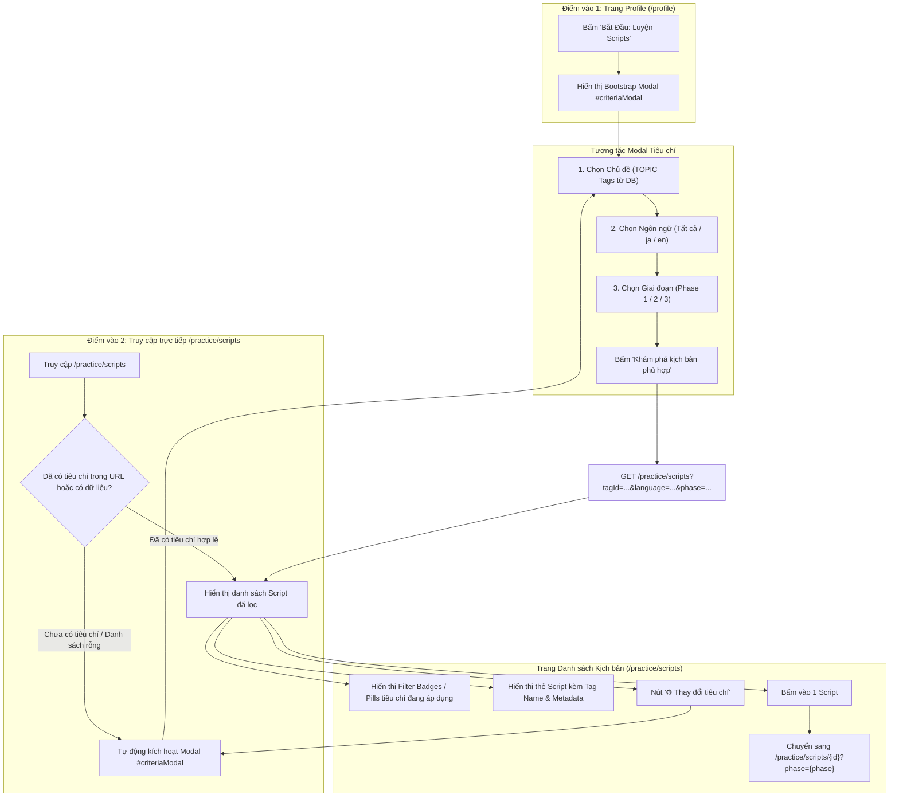

# Kiến Trúc Hệ Thống: Bộ Lọc Tiêu Chí Luyện Kịch Bản Dạng Modal Bootstrap (Script Criteria Selection Modal)

**Vai trò**: Lead Product & System Architect  
**Trạng thái**: APPROVED (Phê duyệt kiến trúc cho Stage 2/3: Code & Triển khai)  
**Tài liệu tham chiếu**: [AGENTS.md](file:///C:/Users/dc130/Desktop/video_marching/AGENTS.md), [spec_ai_speaking_practice.md](file:///C:/Users/dc130/Desktop/video_marching/docs/specs/spec_ai_speaking_practice.md), [spec_audio_to_roleplay_bridge.md](file:///C:/Users/dc130/Desktop/video_marching/docs/specs/spec_audio_to_roleplay_bridge.md)  
**Ngày lập**: 2026-09-12  

---

## 1. Bối Cảnh & Yêu Cầu Sản Phẩm (Product Context & User Journey)

### 1.1. Bối cảnh & Vấn đề giải quyết (Problem Statement)
- **Hiện trạng**:
  - Tại trang cá nhân người dùng (`users/profile.html`), nút **"Bắt Đầu: Luyện Scripts"** trỏ trực tiếp đến URL `/practice/scripts`.
  - Trang danh sách kịch bản (`users/scripts/list.html`) trước đây tải toàn bộ danh sách kịch bản trong hệ thống hoặc chỉ nhận tham số thô chưa có giao diện chọn lọc trực quan.
  - Người học bị "ngợp" (information overload), không chọn được ngay kịch bản phù hợp với:
    1. **Chủ đề thực tế** mà họ muốn giao tiếp (ví dụ: Đi mua sắm tại Combini, Gọi món tại nhà hàng, Hỏi đường, Phỏng vấn, Tiếng Anh chào hỏi hàng ngày).
    2. **Ngôn ngữ mục tiêu** (Tiếng Nhật `ja`, Tiếng Anh `en`...).
    3. **Giai đoạn luyện tập (Phase)** (Giai đoạn 1: Nghe & Nhắc lại; Giai đoạn 2: Điền từ khuyết; Giai đoạn 3: Phản xạ tự do).
- **Mục tiêu sản phẩm**:
  - Tối ưu hóa hành trình người học (Learner UX Flow) theo nguyên lý **Progressive Disclosure & Goal-Oriented Filtering**: Học viên xác định mục tiêu trước khi bước vào danh sách bài học.
  - Cung cấp **Bootstrap 5 Modal** tương tác mượt mà, đồng bộ từ Profile và trang Danh sách kịch bản.
  - Cho phép người dùng dễ dàng theo dõi tiêu chí đang lọc qua các **Filter Badges / Pills** và thay đổi tiêu chí nhanh chóng bất kỳ lúc nào chỉ bằng một cú click.

---

### 1.2. Hành Trình Người Dùng Chi Tiết (User Journey & State Flow)



### 1.3. Chi tiết các thành phần giao diện & Tương tác

#### A. Bootstrap Modal: "Lựa chọn tiêu chí luyện kịch bản" (`#criteriaModal`)
1. **Tiêu chí 1: Chủ đề bài học (Topic / Tag)**:
   - Nguồn dữ liệu: Truy vấn động từ DB các `Tag` thuộc `TagCategoryType.TOPIC` đang hoạt động (`active = true`).
   - Danh sách chủ đề trực quan:
     - *Giới thiệu bản thân* (Self-introduction)
     - *Mua sắm (Shopping / Combini)*
     - *Gọi món tại quán ăn (Restaurant Ordering)*
     - *Du lịch & Hỏi đường (Asking for Directions)*
     - *Tiếng Anh giao tiếp hàng ngày (Daily English)*
     - *Tất cả chủ đề* (Tùy chọn mặc định nếu muốn duyệt toàn bộ).
   - Dạng hiển thị: Grid thẻ Radio chọn nhanh (Selectable Pill / Card buttons) hoặc Dropdown có biểu tượng icon trực quan.
2. **Tiêu chí 2: Ngôn ngữ mục tiêu (Language)**:
   - Các lựa chọn:
     - `all`: Tất cả ngôn ngữ
     - `ja`: 🇯🇵 Tiếng Nhật (Japanese)
     - `en`: 🇬🇧 Tiếng Anh (English)
   - Giá trị mặc định: Ngôn ngữ đang học của người dùng hoặc `all`.
3. **Tiêu chí 3: Giai đoạn luyện tập (Phase)**:
   - `Phase 1`: Nghe & Lặp lại từng câu (Listen & Repeat - Cho người mới bắt đầu)
   - `Phase 2`: Thử thách điền từ khuyết (Fill-in-the-blanks - Rèn luyện ghi nhớ từ khóa)
   - `Phase 3`: Đóng vai & Phản xạ tự do (Full Roleplay - Ẩn kịch bản, nói tự nhiên)
4. **Nút hành động chính (Primary CTA)**:
   - Nhãn: `Khám phá kịch bản phù hợp ➔`
   - Hành vi: Gửi form phương thức `GET` về endpoint `/practice/scripts` kèm các query parameters đã chọn.

#### B. Giao diện Danh sách kịch bản (`users/scripts/list.html`)
1. **Khu vực hiển thị tiêu chí đang áp dụng (Active Filter Pills)**:
   - Nằm ngay dưới tiêu đề chính, dạng thanh tags nổi bật:
     - 🏷️ **Chủ đề**: `[Tên chủ đề đã chọn]` kèm nút `×` để xóa nhanh.
     - 🌐 **Ngôn ngữ**: `[Tiếng Nhật / Tiếng Anh]` kèm nút `×`.
     - 🎯 **Giai đoạn**: `[Giai đoạn 1 / 2 / 3]`.
   - Nút hành động bổ trợ: `⚙️ Thay đổi tiêu chí` (màu outline-primary) với thuộc tính `data-bs-toggle="modal" data-bs-target="#criteriaModal"`.
   - Nút `Xóa toàn bộ bộ lọc` khi có tiêu chí đang active.
2. **Thẻ Kịch bản (Script Card)**:
   - Hiển thị rõ **Tên chủ đề (`tagName`)** dưới dạng badge màu sắc nổi bật (ví dụ: badge xanh nhạt hoặc tím).
   - Hiển thị cờ/mã ngôn ngữ (`JA`, `EN`).
   - Hiển thị thời lượng mục tiêu (`targetDuration` giây).
   - Đường dẫn liên kết: `/practice/scripts/{id}?phase={phase}` đảm bảo giữ đúng giai đoạn người dùng đã chọn.
3. **Trạng thái rỗng & Tự động mở Modal (Empty State & Auto-popup)**:
   - Nếu người dùng truy cập trực tiếp `/practice/scripts` mà chưa chọn tiêu chí hoặc không có script nào khớp bộ lọc:
     - Hiển thị Empty State thân thiện kèm nút lớn `🎯 Mở bộ lọc tiêu chí`.
     - JavaScript tự động kích hoạt Modal Bootstrap (`criteriaModal.show()`) sau khi trang tải xong.

---

## 2. Thiết Kế Kiến Trúc Hệ Thống & Tầng Dữ Liệu

### 2.1. Cập nhật DTO (Data Transfer Objects)

#### A. DTO Đầu vào: `ScriptRequest`
Hỗ trợ đa dạng tiêu chí lọc nhưng vẫn đảm bảo tương thích ngược 100% với code cũ:

```java
package com.example.videocall_marching_language.dto.script;

import lombok.*;
import java.util.List;

@Getter
@Setter
@NoArgsConstructor
@AllArgsConstructor
@Builder
public class ScriptRequest {
    // Tiêu chí chủ đề
    private Long tagId;              // ID chủ đề được chọn từ Modal
    private String tag;              // Tên chủ đề đơn lẻ (vd: ?tag=Shopping)
    private List<String> tags;       // Danh sách tên chủ đề (tương thích ngược với URL cũ ?tags=n5,combini)
    
    // Tiêu chí ngôn ngữ
    private String language;         // Mã ngôn ngữ: 'ja', 'en', 'all', hoặc rỗng
    
    // Tiêu chí giai đoạn & thời lượng
    private Integer phase;           // Giai đoạn luyện tập: 1, 2, 3 (mặc định: 1)
    private Integer minDuration;     // Thời lượng tối thiểu (giây, phục vụ nâng cao)
    private Integer maxDuration;     // Thời lượng tối đa (giây, phục vụ nâng cao)

    // Helper method kiểm tra xem request có chứa bất kỳ bộ lọc nào không
    public boolean hasFilterCriteria() {
        return tagId != null 
            || (tag != null && !tag.isBlank())
            || (tags != null && !tags.isEmpty())
            || (language != null && !language.isBlank() && !"all".equalsIgnoreCase(language))
            || minDuration != null 
            || maxDuration != null;
    }
}
```

#### B. DTO Đầu ra: `ScriptResponse`
Bổ sung `tagId` và `tagName` để giao diện hiển thị chính xác tên chủ đề trên từng thẻ kịch bản:

```java
package com.example.videocall_marching_language.dto.script;

import lombok.*;
import java.util.List;

@Getter
@Setter
@NoArgsConstructor
@AllArgsConstructor
@Builder
public class ScriptResponse {
    private Long id;
    private String title;
    
    // Bổ sung thông tin phân loại chủ đề
    private Long tagId;
    private String tagName;
    
    private List<SentenceRoleResponse> sentences;
    private String language;
    private Integer targetDuration;
    private String phoneticContent;
    private String meaningContent;
}
```

---

### 2.2. Cập nhật Tầng Repository

#### A. Cập nhật `ITagRepository`
Bổ sung truy vấn lấy danh sách Tag theo loại danh mục (`TagCategoryType`) để cung cấp danh sách chủ đề cho Modal:

```java
package com.example.videocall_marching_language.repository;

import com.example.videocall_marching_language.entity.Tag;
import com.example.videocall_marching_language.enums.TagCategoryType;
import org.springframework.data.jpa.repository.JpaRepository;
import org.springframework.data.jpa.repository.Query;
import org.springframework.data.repository.query.Param;

import java.util.List;
import java.util.Optional;

public interface ITagRepository extends JpaRepository<Tag, Long> {
    Optional<Tag> findByName(String name);

    @Query("SELECT t FROM Tag t JOIN FETCH t.tagCategory c " +
            "WHERE c.active = true ORDER BY c.displayOrder ASC, t.name ASC")
    List<Tag> findAllForActiveCategories();

    @Query("SELECT t FROM Tag t JOIN FETCH t.tagCategory c WHERE t.id = :id AND c.active = true")
    Optional<Tag> findSelectableById(@Param("id") Long id);

    // MỚI: Lấy danh sách tags theo phân loại (ưu tiên TOPIC) và danh mục đang hoạt động
    @Query("SELECT t FROM Tag t JOIN FETCH t.tagCategory c " +
           "WHERE c.type = :type AND c.active = true " +
           "ORDER BY t.name ASC")
    List<Tag> findByTagCategoryType(@Param("type") TagCategoryType type);
}
```

#### B. Cập nhật `IScriptRepository`
Thiết kế truy vấn JPQL linh hoạt với mệnh đề điều kiện động và `JOIN FETCH s.tag` nhằm triệt tiêu hoàn toàn bài toán **N+1 Query**:

```java
package com.example.videocall_marching_language.repository;

import com.example.videocall_marching_language.dto.script.IScriptSummaryView;
import com.example.videocall_marching_language.entity.Script;
import org.springframework.data.jpa.repository.JpaRepository;
import org.springframework.data.jpa.repository.JpaSpecificationExecutor;
import org.springframework.data.jpa.repository.Query;
import org.springframework.data.repository.query.Param;
import org.springframework.stereotype.Repository;

import java.util.List;

@Repository
public interface IScriptRepository extends JpaRepository<Script, Long>, JpaSpecificationExecutor<Script> {
    
    // Tương thích ngược
    List<Script> findByTagId(Long tagId);
    List<IScriptSummaryView> findByTagNameIn(List<String> tagNames);

    // MỚI: Truy vấn linh hoạt theo tiêu chí với FETCH JOIN tag
    @Query("SELECT DISTINCT s FROM Script s JOIN FETCH s.tag t " +
           "WHERE (:tagId IS NULL OR t.id = :tagId) " +
           "AND (:tagName IS NULL OR LOWER(t.name) = LOWER(:tagName)) " +
           "AND (:hasTagNames = false OR t.name IN :tagNames) " +
           "AND (:language IS NULL OR :language = '' OR LOWER(s.language) = LOWER(:language)) " +
           "AND (:minDuration IS NULL OR s.targetDuration >= :minDuration) " +
           "AND (:maxDuration IS NULL OR s.targetDuration <= :maxDuration) " +
           "ORDER BY s.id ASC")
    List<Script> findByCriteria(
            @Param("tagId") Long tagId,
            @Param("tagName") String tagName,
            @Param("hasTagNames") boolean hasTagNames,
            @Param("tagNames") List<String> tagNames,
            @Param("language") String language,
            @Param("minDuration") Integer minDuration,
            @Param("maxDuration") Integer maxDuration
    );

    // MỚI: Lấy danh sách ngôn ngữ thực tế đang có trong kịch bản
    @Query("SELECT DISTINCT LOWER(s.language) FROM Script s WHERE s.language IS NOT NULL AND TRIM(s.language) <> ''")
    List<String> findDistinctLanguages();
}
```

---

### 2.3. Cập nhật Tầng Nghiệp Vụ (`PracticeService`)

Thực hiện chuẩn hóa tiêu chí lọc, kết nối dữ liệu và ánh xạ sang `ScriptResponse`:

```java
package com.example.videocall_marching_language.service.script;

// Các import hiện có...
import com.example.videocall_marching_language.enums.TagCategoryType;
import com.example.videocall_marching_language.entity.Tag;
import com.example.videocall_marching_language.repository.ITagRepository;

@Slf4j
@Service
@RequiredArgsConstructor
public class PracticeService {
    private final IScriptRepository scriptRepository;
    private final IUserRepository userRepository;
    private final IPracticeHistoryRepository practiceHistoryRepository;
    private final ITagRepository tagRepository;
    private final com.example.videocall_marching_language.service.ai.AiEvaluationService aiEvaluationService;

    /**
     * Tìm kiếm kịch bản theo tiêu chí đa chiều (TagId, Tên Tag, Ngôn ngữ, Thời lượng)
     */
    public List<ScriptResponse> findScriptsByCriteria(ScriptRequest request) {
        if (request == null) {
            request = new ScriptRequest();
        }

        Long tagId = request.getTagId();
        String tagName = (request.getTag() != null && !request.getTag().isBlank()) ? request.getTag().trim() : null;
        List<String> tagNames = request.getTags();
        boolean hasTagNames = (tagNames != null && !tagNames.isEmpty());

        String language = (request.getLanguage() != null && !request.getLanguage().isBlank() && !"all".equalsIgnoreCase(request.getLanguage()))
                ? request.getLanguage().trim().toLowerCase()
                : null;

        List<Script> scripts = scriptRepository.findByCriteria(
                tagId,
                tagName,
                hasTagNames,
                hasTagNames ? tagNames : List.of(""),
                language,
                request.getMinDuration(),
                request.getMaxDuration()
        );

        return scripts.stream().map(s -> ScriptResponse.builder()
                .id(s.getId())
                .title(s.getTitle())
                .language(s.getLanguage())
                .targetDuration(s.getTargetDuration())
                .phoneticContent(s.getPhoneticContent())
                .meaningContent(s.getMeaningContent())
                .tagId(s.getTag() != null ? s.getTag().getId() : null)
                .tagName(s.getTag() != null ? s.getTag().getName() : null)
                .build()
        ).toList();
    }

    /**
     * Tương thích ngược với phương thức cũ
     */
    public List<ScriptResponse> findScriptsByTagAndPhase(ScriptRequest request) {
        return findScriptsByCriteria(request);
    }

    /**
     * Lấy danh sách các chủ đề (TOPIC tags) phục vụ hiển thị trong Modal
     */
    public List<Tag> getAvailableTopics() {
        return tagRepository.findByTagCategoryType(TagCategoryType.TOPIC);
    }

    /**
     * Lấy danh sách các mã ngôn ngữ có trong hệ thống
     */
    public List<String> getAvailableLanguages() {
        List<String> languages = scriptRepository.findDistinctLanguages();
        if (languages.isEmpty()) {
            return List.of("ja", "en");
        }
        return languages;
    }

    // Các method hiện có giữ nguyên (findScriptById, startPractice, checkSpeech...)...
}
```

---

### 2.4. Cập nhật Tầng Controller

#### A. Cập nhật `PracticeController` (`/practice/scripts`)
Controller tiếp nhận yêu cầu, chuẩn bị dữ liệu cho View gồm danh sách kịch bản, bộ tiêu chí đã chọn, danh sách chủ đề & ngôn ngữ cho modal:

```java
package com.example.videocall_marching_language.controller.user;

import com.example.videocall_marching_language.dto.script.ScriptRequest;
import com.example.videocall_marching_language.dto.script.ScriptResponse;
import com.example.videocall_marching_language.entity.Tag;
import com.example.videocall_marching_language.service.script.PracticeService;
import lombok.RequiredArgsConstructor;
import org.springframework.stereotype.Controller;
import org.springframework.ui.Model;
import org.springframework.web.bind.annotation.GetMapping;
import org.springframework.web.bind.annotation.PathVariable;
import org.springframework.web.bind.annotation.RequestMapping;
import org.springframework.web.bind.annotation.RequestParam;

import java.util.List;

@Controller
@RequiredArgsConstructor
@RequestMapping("/practice")
public class PracticeController {

    private final PracticeService practiceService;

    @GetMapping("/scripts")
    public String getScriptsByCriteria(
            ScriptRequest request,
            @RequestParam(value = "autoOpen", required = false) Boolean autoOpen,
            Model model) {

        // 1. Lọc danh sách kịch bản
        List<ScriptResponse> scriptList = practiceService.findScriptsByCriteria(request);

        // 2. Dữ liệu bổ trợ cho Modal
        List<Tag> availableTopics = practiceService.getAvailableTopics();
        List<String> availableLanguages = practiceService.getAvailableLanguages();

        // 3. Xác định tên chủ đề đang chọn (nếu có tagId)
        String selectedTopicName = null;
        if (request.getTagId() != null) {
            selectedTopicName = availableTopics.stream()
                    .filter(t -> t.getId().equals(request.getTagId()))
                    .map(Tag::getName)
                    .findFirst()
                    .orElse(null);
        } else if (request.getTag() != null && !request.getTag().isBlank()) {
            selectedTopicName = request.getTag();
        } else if (request.getTags() != null && !request.getTags().isEmpty()) {
            selectedTopicName = String.join(", ", request.getTags());
        }

        // 4. Quyết định mở modal tự động:
        // Nếu user yêu cầu autoOpen=true, hoặc truy cập mà chưa chọn tiêu chí nào, hoặc danh sách trả về rỗng
        boolean shouldOpenModal = Boolean.TRUE.equals(autoOpen) 
                || !request.hasFilterCriteria() 
                || scriptList.isEmpty();

        int phase = (request.getPhase() != null && request.getPhase() >= 1 && request.getPhase() <= 3) 
                ? request.getPhase() 
                : 1;

        model.addAttribute("scripts", scriptList);
        model.addAttribute("criteria", request);
        model.addAttribute("phase", phase);
        model.addAttribute("selectedTopicName", selectedTopicName);
        model.addAttribute("availableTopics", availableTopics);
        model.addAttribute("availableLanguages", availableLanguages);
        model.addAttribute("shouldOpenModal", shouldOpenModal);

        return "users/scripts/list";
    }

    @GetMapping("/scripts/{id}")
    public String getScriptById(
            @PathVariable int id,
            @RequestParam(value = "phase", defaultValue = "1") int phase,
            Model model) {
        ScriptResponse scriptResponse = practiceService.findScriptById(id);
        model.addAttribute("script", scriptResponse);
        model.addAttribute("phase", phase);
        return "users/scripts/learn";
    }
}
```

#### B. Cập nhật `ProfileController` (`/profile`)
Truyền danh sách `availableTopics` và `availableLanguages` vào trang Profile để render Modal hoặc liên kết kích hoạt:

```java
@GetMapping("/profile")
public String showProfile(Authentication authentication, Model model) {
    model.addAttribute("profile", userService.getCurrentProfile(authentication.getName()));
    model.addAttribute("availableTopics", practiceService.getAvailableTopics());
    model.addAttribute("availableLanguages", practiceService.getAvailableLanguages());
    return "users/profile";
}
```

---

## 3. Thiết Kế Giao Diện Người Dùng & Chuẩn Bootstrap 5 (UI/UX Specification)

### 3.1. Cấu trúc HTML & CSS Thống nhất

#### A. Nút kích hoạt tại `users/profile.html`
Thay thế nút link thông thường bằng nút mở Bootstrap 5 Modal trực tiếp:

```html
<!-- Nút kích hoạt Modal trên Profile -->
<button type="button" class="btn btn-outline-primary" data-bs-toggle="modal" data-bs-target="#criteriaModal">
    🎯 Bắt Đầu: Luyện Scripts
</button>
```

#### B. Component Modal Tiêu chí (`#criteriaModal`)
Được nhúng vào cả `users/profile.html` và `users/scripts/list.html` (hoặc thông qua Thymeleaf Fragment `fragments/criteria_modal.html`):

```html
<!-- Modal: Lựa chọn tiêu chí luyện kịch bản -->
<div class="modal fade" id="criteriaModal" tabindex="-1" aria-labelledby="criteriaModalLabel" aria-hidden="true">
    <div class="modal-dialog modal-dialog-centered modal-lg">
        <div class="modal-content border-0 shadow-lg" style="border-radius: 16px; overflow: hidden;">
            <div class="modal-header bg-primary text-white p-4">
                <div>
                    <h5 class="modal-title fw-bold fs-4 mb-1" id="criteriaModalLabel">
                        🎯 Lựa Chọn Tiêu Chí Luyện Kịch Bản
                    </h5>
                    <p class="mb-0 text-white-50 small">
                        Hệ thống sẽ lọc kịch bản AI phù hợp nhất với mục tiêu giao tiếp thực tế của bạn
                    </p>
                </div>
                <button type="button" class="btn-close btn-close-white" data-bs-dismiss="modal" aria-label="Đóng"></button>
            </div>

            <form th:action="@{/practice/scripts}" method="get">
                <div class="modal-body p-4">
                    <!-- 1. Tiêu chí: Chủ đề bài học (TOPIC) -->
                    <div class="mb-4">
                        <label class="form-label fw-bold text-dark d-flex align-items-center gap-2 mb-2">
                            <span>📚 Chủ đề bài học</span>
                            <span class="badge bg-primary-subtle text-primary fw-medium">Bắt buộc / Tùy chọn</span>
                        </label>
                        <div class="row g-2">
                            <div class="col-md-6 col-lg-4">
                                <input type="radio" class="btn-check" name="tagId" id="topic_all" value="" 
                                       th:checked="${criteria == null or criteria.tagId == null}">
                                <label class="btn btn-outline-secondary w-100 text-start p-3 h-100 rounded-3 d-flex align-items-center gap-2" for="topic_all">
                                    <span class="fs-4">🌐</span>
                                    <div>
                                        <div class="fw-semibold">Tất cả chủ đề</div>
                                        <small class="text-muted">Khám phá toàn bộ</small>
                                    </div>
                                </label>
                            </div>
                            <div class="col-md-6 col-lg-4" th:each="topic : ${availableTopics}">
                                <input type="radio" class="btn-check" name="tagId" 
                                       th:id="${'topic_' + topic.id}" 
                                       th:value="${topic.id}"
                                       th:checked="${criteria != null and criteria.tagId == topic.id}">
                                <label class="btn btn-outline-primary w-100 text-start p-3 h-100 rounded-3 d-flex align-items-center gap-2" 
                                       th:for="${'topic_' + topic.id}">
                                    <span class="fs-4">
                                        <span th:if="${#strings.contains(topic.name, 'Giới thiệu')}">🤝</span>
                                        <span th:if="${#strings.contains(topic.name, 'Mua sắm')}">🛒</span>
                                        <span th:if="${#strings.contains(topic.name, 'Hỏi đường') or #strings.contains(topic.name, 'Du lịch')}">🗺️</span>
                                        <span th:if="${#strings.contains(topic.name, 'quán ăn') or #strings.contains(topic.name, 'Gọi món')}">🍜</span>
                                        <span th:if="${#strings.contains(topic.name, 'Anh')}">🇬🇧</span>
                                        <span th:unless="${#strings.contains(topic.name, 'Giới thiệu') or #strings.contains(topic.name, 'Mua sắm') or #strings.contains(topic.name, 'Hỏi đường') or #strings.contains(topic.name, 'quán ăn') or #strings.contains(topic.name, 'Anh')}">💬</span>
                                    </span>
                                    <div>
                                        <div class="fw-semibold text-truncate" th:text="${topic.name}">Chủ đề</div>
                                        <small class="text-muted">Tình huống thực tế</small>
                                    </div>
                                </label>
                            </div>
                        </div>
                    </div>

                    <!-- 2. Tiêu chí: Ngôn ngữ & Giai đoạn -->
                    <div class="row g-3 mb-2">
                        <!-- Ngôn ngữ -->
                        <div class="col-md-6">
                            <label class="form-label fw-bold text-dark mb-2">🗣️ Ngôn ngữ giao tiếp</label>
                            <select class="form-select form-select-lg rounded-3" name="language">
                                <option value="all" th:selected="${criteria == null or criteria.language == null or criteria.language == 'all'}">
                                    Tất cả ngôn ngữ
                                </option>
                                <option value="ja" th:selected="${criteria != null and criteria.language == 'ja'}">
                                    🇯🇵 Tiếng Nhật (Japanese)
                                </option>
                                <option value="en" th:selected="${criteria != null and criteria.language == 'en'}">
                                    🇬🇧 Tiếng Anh (English)
                                </option>
                            </select>
                        </div>

                        <!-- Giai đoạn (Phase) -->
                        <div class="col-md-6">
                            <label class="form-label fw-bold text-dark mb-2">⚡ Hình thức &amp; Giai đoạn</label>
                            <select class="form-select form-select-lg rounded-3" name="phase">
                                <option value="1" th:selected="${phase == 1 or criteria == null}">
                                    Giai đoạn 1: Nghe &amp; Nhắc lại từng câu (Beginner)
                                </option>
                                <option value="2" th:selected="${phase == 2}">
                                    Giai đoạn 2: Khuyết từ vựng quan trọng (Intermediate)
                                </option>
                                <option value="3" th:selected="${phase == 3}">
                                    Giai đoạn 3: Đóng vai &amp; Ẩn kịch bản (Advanced)
                                </option>
                            </select>
                        </div>
                    </div>
                </div>

                <div class="modal-footer bg-light p-3 border-top-0 d-flex justify-content-between">
                    <button type="button" class="btn btn-light px-4 py-2 rounded-pill" data-bs-dismiss="modal">Hủy bỏ</button>
                    <button type="submit" class="btn btn-primary px-4 py-2 rounded-pill fw-semibold shadow-sm">
                        Khám phá kịch bản phù hợp ➔
                    </button>
                </div>
            </form>
        </div>
    </div>
</div>
```

#### C. Giao diện `users/scripts/list.html` nâng cấp
Tích hợp thư viện Bootstrap 5 (`css/bootstrap.min.css`, `js/bootstrap.bundle.min.js`), thanh Active Filter Badges, các Card Script và logic tự động bật Modal:

```html
<!-- Phần Active Filters Bar trong list.html -->
<div class="card border-0 shadow-sm mb-4 rounded-4 bg-white p-3">
    <div class="d-flex flex-wrap align-items-center justify-content-between gap-3">
        <div class="d-flex flex-wrap align-items-center gap-2">
            <span class="text-muted fw-semibold small me-1">Đang lọc theo:</span>
            
            <!-- Badge Chủ đề -->
            <span class="badge bg-primary-subtle text-primary border border-primary-subtle px-3 py-2 rounded-pill fs-6 fw-normal d-flex align-items-center gap-1"
                  th:if="${selectedTopicName != null}">
                <span>📚</span>
                <strong th:text="${selectedTopicName}">Giới thiệu bản thân</strong>
            </span>
            <span class="badge bg-secondary-subtle text-secondary border px-3 py-2 rounded-pill fs-6 fw-normal"
                  th:unless="${selectedTopicName != null}">
                📚 Tất cả chủ đề
            </span>

            <!-- Badge Ngôn ngữ -->
            <span class="badge bg-info-subtle text-info-emphasis border border-info-subtle px-3 py-2 rounded-pill fs-6 fw-normal"
                  th:if="${criteria != null and criteria.language != null and criteria.language != 'all' and !criteria.language.isBlank()}">
                <span>🌐</span>
                <span th:text="${criteria.language == 'ja' ? 'Tiếng Nhật (ja)' : (criteria.language == 'en' ? 'Tiếng Anh (en)' : criteria.language)}"></span>
            </span>

            <!-- Badge Giai đoạn -->
            <span class="badge bg-warning-subtle text-warning-emphasis border border-warning-subtle px-3 py-2 rounded-pill fs-6 fw-normal">
                <span>🎯</span>
                <span th:text="'Giai đoạn ' + ${phase}">Giai đoạn 1</span>
            </span>
        </div>

        <div class="d-flex gap-2">
            <a th:if="${criteria != null and criteria.hasFilterCriteria()}" 
               th:href="@{/practice/scripts}" 
               class="btn btn-outline-secondary btn-sm rounded-pill px-3">
                Xóa bộ lọc
            </a>
            <button type="button" class="btn btn-primary btn-sm rounded-pill px-3 fw-semibold shadow-sm d-flex align-items-center gap-1"
                    data-bs-toggle="modal" data-bs-target="#criteriaModal">
                <span>⚙️ Thay đổi tiêu chí</span>
            </button>
        </div>
    </div>
</div>
```

#### D. Đoạn mã JavaScript tự động kích hoạt Modal
```javascript
document.addEventListener('DOMContentLoaded', function () {
    // Nhận cờ shouldOpenModal từ Spring Model
    var shouldOpen = /*[[${shouldOpenModal}]]*/ false;
    var modalElement = document.getElementById('criteriaModal');
    
    if (modalElement && shouldOpen) {
        var modal = new bootstrap.Modal(modalElement);
        modal.show();
    }
});
```

---

## 4. Phân Tích Tính Tương Thích Ngược & An Toàn Hệ Thống

| Khu vực | Hiện trạng | Thay đổi | Đảm bảo tương thích (Backward Compatibility) |
| :--- | :--- | :--- | :--- |
| **URL Parameters** | Nhận `?tags=...&phase=...` | Bổ sung `?tagId=...&language=...&minDuration=...` | Giữ nguyên các query params cũ (`tags`, `phase`). Request cũ vẫn map chính xác vào `ScriptRequest`. |
| **Service Signature** | `findScriptsByTagAndPhase(ScriptRequest)` | Đổi core sang `findScriptsByCriteria(ScriptRequest)` | `findScriptsByTagAndPhase` gọi ủy quyền thẳng vào `findScriptsByCriteria`, không làm gãy bất kỳ Unit Test hay Controller nào. |
| **DTO Field Mapping** | `ScriptResponse` thiếu thông tin Tag | Bổ sung `tagId`, `tagName` | Các trường cũ (`id`, `title`, `sentences`, `language`, `targetDuration`) giữ nguyên 100%. |
| **Database Schema** | Bảng `scripts` đã có cột `tag_id`, `language`, `target_duration` | Không cần migration DDL mới | Tận dụng chính xác schema hiện hành từ Flyway V5. Dữ liệu đã có sẵn trong bảng `scripts` và `tags`. |
| **Frontend Styles** | `list.html` dùng inline/custom CSS riêng | Bổ sung Bootstrap 5 CSS & JS từ local static | Đồng bộ với trang `profile.html` và toàn bộ layout hệ thống. |

---

## 5. Kịch Bản Kiểm Thử Chấp Nhận (Acceptance Criteria - Gherkin)

### Scenario 1: Người dùng mở Modal từ Profile và chọn tiêu chí
- **Given**: Người dùng đang ở trang `/profile`.
- **When**: Người dùng bấm nút "🎯 Bắt Đầu: Luyện Scripts".
- **Then**: Modal Bootstrap `#criteriaModal` hiển thị ngay lập tức với đầy đủ danh sách chủ đề (lấy từ các tag có category `TOPIC`).
- **When**: Người dùng chọn chủ đề "Mua sắm (Shopping)", ngôn ngữ "Tiếng Nhật (ja)", giai đoạn 1 và bấm "Khám phá kịch bản phù hợp".
- **Then**: Trình duyệt điều hướng sang `/practice/scripts?tagId={shoppingTagId}&language=ja&phase=1`.
- **And**: Danh sách hiển thị đúng các kịch bản mua sắm bằng tiếng Nhật.

### Scenario 2: Người dùng truy cập trực tiếp URL mà chưa có tiêu chí
- **Given**: Người dùng gõ trực tiếp URL `/practice/scripts` vào thanh địa chỉ của trình duyệt.
- **When**: Trang web tải xong.
- **Then**: Hệ thống nhận diện `hasFilterCriteria = false`.
- **And**: Modal `#criteriaModal` tự động bật lên trên màn hình để người dùng lựa chọn chủ đề trước khi học.

### Scenario 3: Thay đổi tiêu chí ngay trên trang danh sách kịch bản
- **Given**: Người dùng đang xem danh sách kịch bản lọc theo "Tiếng Nhật".
- **When**: Người dùng bấm nút "⚙️ Thay đổi tiêu chí".
- **Then**: Modal `#criteriaModal` mở ra với các giá trị đã chọn trước đó được giữ nguyên (pre-selected).
- **When**: Người dùng đổi sang ngôn ngữ "Tiếng Anh (en)" và bấm Xác nhận.
- **Then**: Trang làm mới và hiển thị các kịch bản tiếng Anh (ví dụ: Daily English Greeting & Coffee).

### Scenario 4: Trạng thái không tìm thấy kịch bản phù hợp (Empty State)
- **Given**: Người dùng chọn một tiêu chí không có kịch bản nào trong DB (ví dụ: Chủ đề N3, tiếng Anh).
- **When**: Trang `/practice/scripts` trả về danh sách rỗng.
- **Then**: Hiển thị giao diện Empty State thân thiện kèm nút bấm mở lại modal thay đổi tiêu chí.

---

## 6. Kế Hoạch Triển Khai Cho Stage 2/3 (Implementation Checklist)

1. **Tầng DTO**:
   - [ ] Cập nhật `ScriptRequest.java`: thêm `tagId`, `tag`, `language`, `minDuration`, `maxDuration`, phương thức `hasFilterCriteria()`.
   - [ ] Cập nhật `ScriptResponse.java`: thêm `tagId`, `tagName`.
2. **Tầng Repository**:
   - [ ] Cập nhật `ITagRepository.java`: thêm query `findByTagCategoryType(TagCategoryType type)`.
   - [ ] Cập nhật `IScriptRepository.java`: thêm method `findByCriteria(...)` và `findDistinctLanguages()`.
3. **Tầng Service**:
   - [ ] Cập nhật `PracticeService.java`: triển khai `findScriptsByCriteria`, `getAvailableTopics`, `getAvailableLanguages`. Đảm bảo `findScriptsByTagAndPhase` ủy quyền an toàn.
4. **Tầng Controller**:
   - [ ] Cập nhật `PracticeController.java`: chỉnh sửa `@GetMapping("/scripts")` inject đủ dữ liệu vào Model.
   - [ ] Cập nhật `ProfileController.java`: inject `availableTopics` và `availableLanguages` vào Model trang profile.
5. **Tầng View (HTML/Thymeleaf/JS)**:
   - [ ] Cập nhật `users/profile.html`: nhúng Modal tiêu chí và đổi nút Luyện Scripts thành trigger modal.
   - [ ] Cập nhật `users/scripts/list.html`: thêm Bootstrap CSS/JS, nhúng Modal tiêu chí, hiển thị Filter Badges, nút "Thay đổi tiêu chí", và JS auto-open khi chưa chọn hoặc danh sách rỗng.
6. **Kiểm tra chất lượng (QA & Verification)**:
   - [ ] Chạy `./gradlew compileJava` và `./gradlew test` đảm bảo 100% build pass.
   - [ ] Kiểm tra thực tế luồng tương tác trên trình duyệt.

---

## 7. Quyết Định Phê Duyệt Kiến Trúc (Architectural Approval)

> **KẾT LUẬN CỦA LEAD PRODUCT & SYSTEM ARCHITECT**:  
> Bản đặc tả kỹ thuật này giải quyết triệt để bài toán định hướng học tập cho học viên, tuân thủ chặt chẽ kiến trúc hiện hành của dự án (`com.example.videocall_marching_language`), tận dụng tối đa cơ sở dữ liệu đã chuẩn hóa (Flyway V5), đảm bảo không gây lỗi vỡ tương thích (non-breaking changes) và cung cấp giao diện hiện đại theo chuẩn Bootstrap 5.
>
> **TRẠNG THÁI: PHÊ DUYỆT (APPROVED)**.  
> Đã sẵn sàng chuyển giao sang **Stage 2/3: Triển khai Code & Kiểm thử tự động**.
